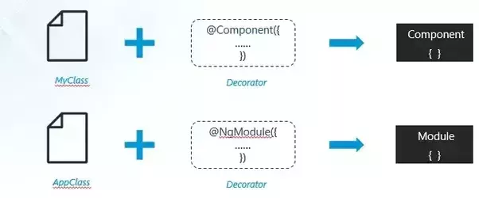

What are decorators?
[docs.angularjs.org/guide/decorators](https://docs.angularjs.org/guide/decorators)

Decorators are a design pattern that is used to separate modification or decoration of a class without modifying the original source code. In Angular, decorators are functions that allow a service, directive or filter to be modified prior to its usage.

In angular you create classes for everything, be it components, services, directives, etc.

So, how does angular compiler compiles your code and transforms it into ready-to-be-run scripts in browser?

This happens because of decorators. In simple term, decorators allows you to attach meta data with the typescript class using which angular knows whether that class is a component or directive or module or etc.

Normally prefixed with an ‘@’



As a design pattern decorator :

Attaches additional responsibilities to an object dynamically
Offers flexible alternative to sub-classing for extending functionality

**There are four main types of decorators:**

**Class decorators**, e.g. @Component and @NgModule

**Property decorators** for properties inside classes, e.g. @Input and @Output

**Method decorators** for methods inside classes, e.g. @HostListener

**Parameter decorators** for parameters inside class constructors, e.g. @Inject
**@ContentChildren** is also a parameter decorator that is used to fetch the QueryList of elements or directives from the content DOM. The QueryList is updated whenever the child element/component is added or removed.

Notice the () on **@Component** which is a Class Decorators. This means that the @Component is called once JavaScript encounters @Component(). In turn, this means that there must be a Component function somewhere that returns a function matching one of the decorator signatures outlined above. This is an example of the decorator factory pattern.

[ultimatecourses.com/blog/angular-decorators](https://ultimatecourses.com/blog/angular-decorators)

**Class Decorators**

Angular offers us a few class decorators. These are the top-level decorators that we use to express intent for classes. They allow us to tell Angular that a particular class is a component, or module, for example. And the decorator allows us to define this intent without having to actually put any code inside the class.

A @Component and @NgModule decorator example with classes:

```js
import { NgModule, Component } from "@angular/core"

@Component({
  selector: "example-component",
  template: "<div>Woo a component!</div>",
})
export class ExampleComponent {
  constructor() {
    console.log("Hey I am a component!")
  }
}

@NgModule({
  imports: [],
  declarations: [],
})
export class ExampleModule {
  constructor() {
    console.log("Hey I am a module!")
  }
}
```

Notice how both classes by themselves are effectively the same. No code is needed within the class to tell Angular that it is a component or a module. All we need to do is decorate it, and Angular will do the rest.

**Here’s the list of decorators available in Angular:**

@NgModule
@Component
@Injectable
@Directive
@Pipe
@Input
@Output
@HostBinding
@HostListener
@ContentChild
@ContentChildren
@ViewChild
@ViewChildren

### Further Reading

[list-of-all-decorators-available-in-angular-71bdf4ad6976](https://medium.com/@madhavmahesh/list-of-all-decorators-available-in-angular-71bdf4ad6976)
