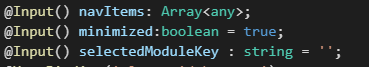
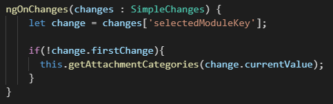

SimpleChanges is an Angular/Core feature that can be used to see the changes and a few more details of the declared property names in a component. And also it needs to be used in the Angular ngOnChange method to see the values changes and to do relevant things.

#### SimpleChange

Represents a basic change from a previous to a new value for a single property on a directive instance. Passed as a value in a SimpleChanges object to the ngOnChanges hook.

```ts
class SimpleChange {
    constructor(previousValue: any, currentValue: any, firstChange: boolean);
    previousValue: any;
    currentValue: any;
    firstChange: boolean;
    isFirstChange(): boolean;
}
```

#### PreviesValue :

will give you the value that the property has previously.

#### currentValue:

will give you the current value of the property.

####firstChange():
this is a method and it will return true if the previous value and the current values are the same or else false.

#### For what we can use this?

Let's assume we have these properties declared in the Angular Component.



And whenever a value changes happen to one of these properties you need to run a method or do something in the application. and you need to do it if the changed value is not the same value previously the property had.

So, in this case, we will need an extra variable to hold the current value and check with the new value or some kind of trick to perform this task if we go with basics.
Here you go, this is the place this SimpleChanges going to help you.

And let's assume I need to check the previous value and the current value of the **“selecteModuleKey”** property and if it's changed then I need to execute a method. So let's get it done as below.


