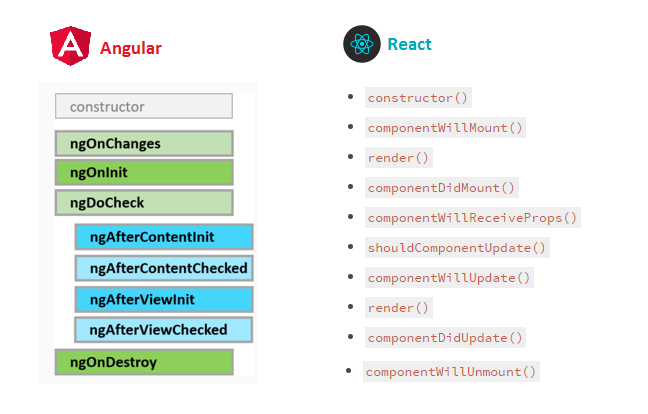

```js
export class App implements OnInit {
  constructor() {
    //called first time before the ngOnInit()
  }

  ngOnInit() {
    //called after the constructor and called  after the first ngOnChanges()
  }
}
```

#### Constructor

A class constructor in Angular is mostly used to inject dependencies. Angular calls this constructor injection pattern.

The Constructor is a default method of the class that is executed when the class is instantiated and ensures proper initialisation of fields in the class and its subclasses. It has nothing to do with Angular2.
Angular, or better Dependency Injector (DI), analyses the constructor parameters and when it creates a new instance by calling new MyClass() it tries to find providers that match the types of the constructor parameters, resolves them and passes them to the constructor

### NgOnInit

- **ngOnChanges is called when an @Input or output binding value changes**
- **ngOnInit is called after the first ngOnChanges**

#### Now when does `ngOnChanges` is called

[angular.io/guide/lifecycle-hooks](https://angular.io/guide/lifecycle-hooks)

Respond when Angular (re)sets data-bound input properties. The method receives a SimpleChanges object of current and previous property values. Called before ngOnInit() and whenever one or more data-bound input properties change.

When Angular calls **ngOnInit** it has finished creating a component DOM, injected all required dependencies through constructor and processed input bindings. And all of the class members has been defined. So here you have all the required information available which makes it a good place to perform initialization logic.

It’s a common practice to use `ngOnInit` to perform initialization logic even if this logic doesn’t depend on DI, DOM or input bindings.

Mostly we use **ngOnInit** for all the initialization/declaration and avoid stuff to work in the constructor. The constructor should only be used to initialize class members but shouldn't do actual "work".

So you should use constructor() to setup Dependency Injection and not much else. ngOnInit() is better place to "start" - it's where/when components' bindings are resolved.

**[angular.io/api/core/OnInit](https://angular.io/api/core/OnInit)**

ngOnInit()

A callback method that is invoked immediately after the default change detector has checked the directive's data-bound properties for the first time, and before any of the view or content children have been checked. It is invoked only once when the directive is instantiated.s

Let’s put it all together and see them both in action:

```js
import {Component, OnInit} from '@angular/core';

export class AppComponent implements OnInit {

                  constructor(myService: MyService) {
                  //Let’s assume this will return an array of samples [‘sample 1’, ‘sample 2’, ‘sample 3’]
                  this.samples = myService.getSamples();
                  this.sentence = ‘Number of samples: ’;
  }

ngOnInit() {
  this.countSamples();
}

countSamples() {
  //Result will be ‘Number of samples: 3’
         this.sentence = this.sentence + this.samples.length;
  }
}
```

In this example we are injecting the dependency myService. You should not confuse this with MyService (note the uppercase ‘M’) which is the type of the service. Then we are calling the method myService.getSamples() which will resolve with an array. In our ngOnInit() method we call the function this.countSamples() which is able to work with the (already initialized and resolved) fields this.samples and this.sentence. We can see that countSamples() simply appends the length of this.samples to the string this.sentence.

#### Lastly take a look at the comparison between lifecycle hooks between React and Angular


