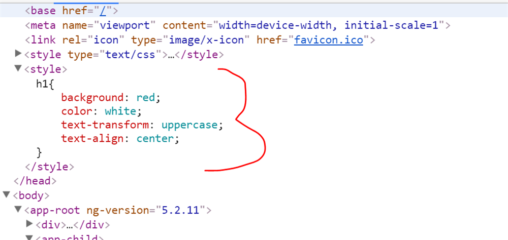

#### ViewEncapsulation.Emulated

The Emulated mode is the default one. This allows that styles from main HTML propagate to the component but styles defined in this component's @Component decorator are scoped to this component only.

#### ViewEncapsulation.None

In the None mode, styles from the component propagate back to the main HTML and therefore are visible to all components on the page. Be careful with apps that have None components in the application.

Since the default view encapsulation mode in Angular is Emulated, for us to specify a different mode in your components, we have to do like this:

```js
import { Component, ViewEncapsulation } from "@angular/core";

@Component({
	selector: "app-servers",
	template: `
    <h3 class="title">App Servers Component</h3>
    <app-server></app-server>
  `,
	styleUrls: ["./servers.component.css"],
	//encapsulation None
	encapsulation: ViewEncapsulation.None
})
export class ServersComponent {}
```

Let's try to understand it using an example. I have created a component, as shown below:

##### app.component.ts

```js
import { Component, ViewEncapsulation } from "@angular/core";
@Component({
	selector: "app-root",
	templateUrl: "./app.component.html",
	styleUrls: ["./app.component.css"],
	encapsulation: ViewEncapsulation.None
})
export class AppComponent {
	title = "parent component";
}
```

##### app.component.html app.component.css

```css
h1 {
	background: red;
	color: white;
	text-transform: uppercase;
	text-align: center;
}
```

We are setting the style of h1 in the component CSS. We have also created another component:

##### AppChildComponent.ts

```js
import { Component } from "@angular/core";
@Component({
	selector: "app-child",
	template: `
  <h1>{{title}}</h1>
  `
})
export class AppChildComponent {
	title = "child app";
}
```

Let us start with ViewEncapsulation.None, in this option:

    1. There is no shadow DOM.
    2. Style is not scoped to the component.

**As you run the application, you will find h1 style has applied to both components, even though we only set style the in AppComponent. This happened because in AppComponent we have set the encapsulation property to ViewEncapsulation.None. ViewEncapsulation.None bubbles up to the whole application, so if you are going with this solution is may be a good idea to wrap your CSS with a wrapper class.**

```js
@Component({
	selector: "app-root",
	templateUrl: "./app.component.html",
	styleUrls: ["./app.component.css"],
	encapsulation: ViewEncapsulation.None
})
export class AppComponent {
	title = "parent component";
}
```



In the browser, when you examine source code, you will find the h1 style has been declared in the head section of the DOM.

In AppChildComponent, we are also using the h1 tag. To understand different ViewEncapsulation options, we will change the metadata of AppComponent.

**Therefore, in ViewEncapsulation.None, the style gets moved to the DOM's head section and is not scoped to the component. There is no Shadow DOM for the component and the component style can affect all nodes in the DOM.**

### Using /deep/ when ViewEncapsulation.None will NOT allow you a component's local css to be applied

Here I am trying modify the color a mat-slide-toggle component, when its checked / toggled position

If the below does not work

```css
.mat-slide-toggle.mat-checked .mat-slide-toggle-bar {
	background-color: rgba(147, 1, 41, 0.54);
}
```

Then just do this

```css
/deep/ .mat-slide-toggle.mat-checked .mat-slide-toggle-bar {
	background-color: rgba(147, 1, 41, 0.54);
}
```

**Use the /deep/ shadow-piercing descendant combinator to force a style down through the child component tree into all the child component views. The /deep/ combinator works to any depth of nested components, and it applies to both the view children and content children of the component.**

#### Further Reading

[https://dev.to/monicafidalgo/what-is-viewencapsulation-in-angular-470o](https://dev.to/monicafidalgo/what-is-viewencapsulation-in-angular-470o)

[https://dzone.com/articles/what-is-viewencapsulation-in-angular](https://dzone.com/articles/what-is-viewencapsulation-in-angular)
