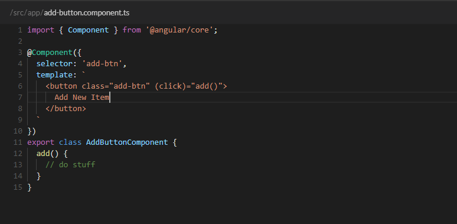
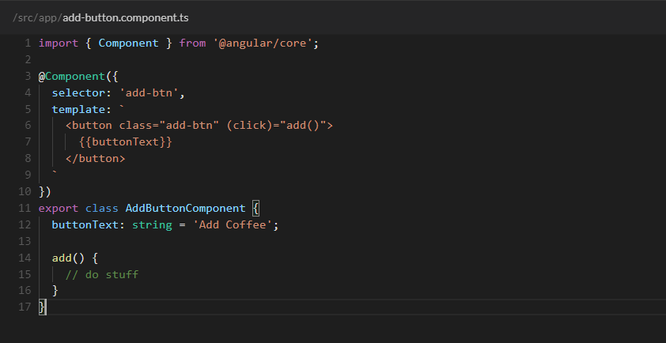
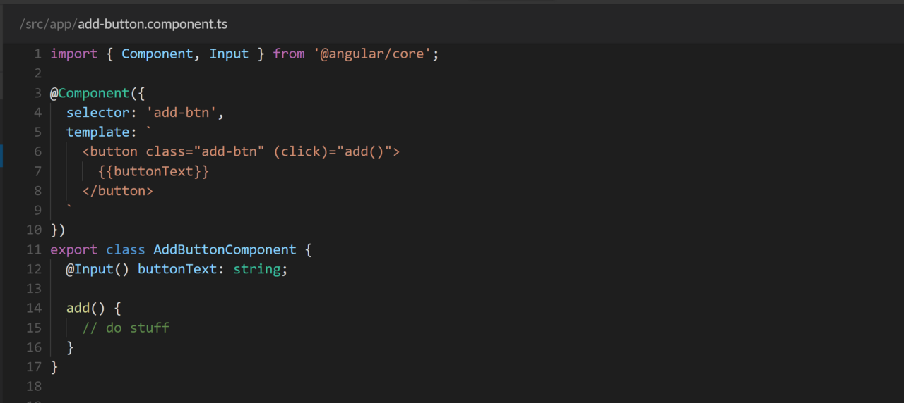
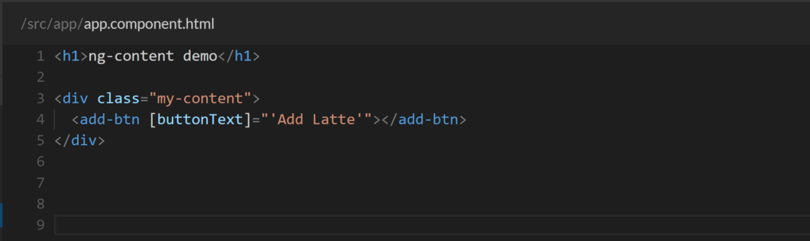
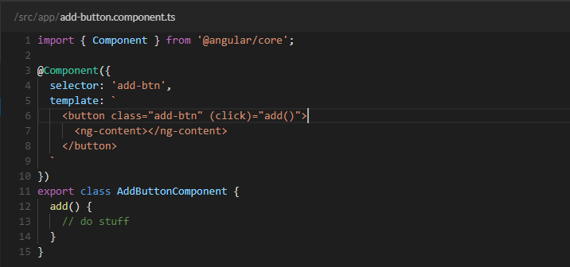

One of the main goals of Angular is to help the developer create reusable and composable components. I think ng-content is one of the simplest ways to do that once you understand how it works.

Dynamic content. That is the simplest way to explain what ng-content provides. You use the
`<ng-content></ng-content>` tag as a placeholder for that dynamic content, then when the template is parsed Angular will replace that placeholder tag with your content. Think of it like curly brace interpolation, but on a bigger scale. The technical term for this is “content projection" because you are projecting content from the parent component into the designated child component.
If you understand {{myValue}}, then you understand the basics of what ng-content does. The difference is where that value comes from. With normal curly brace interpolation the value comes from the component. With ng-content the value comes from the component in its execution context.

Let’s say you want to create a reusable button in your app.

Here we can see a generic add button which triggers an event when clicked. Nothing crazy here. The main thing I want to point out is the button’s text. “Add New Item" is hard-coded in the template. But, what if we wanted to get more specific with our button text? For example, “Add Coffee". We could put that value in the component like this:

Or even as an Input from the parent component like this:

These ways work but this is where ng-content shines. Take a look at this:

See what’s happening here?

In the template for the reusable add button component we use the <ng-content></ng-content> tag as our placeholder for the button text. This is telling Angular, “Hey, I don’t know what this is supposed to be right now but, I promise to tell you later”.

Then when the button component is actually being used… BAM! We put whatever text we want inside the component

Dynamic text is just the tip of the metaphorical iceberg though. You can put lots of different things inside the component. Including HTML tags and even other components.

### Further Reading

[wtf-is-ng-content-8382b2a664e1](https://medium.com/@joshblf/wtf-is-ng-content-8382b2a664e1)
[https://blog.angular-university.io/angular-ng-content/](https://blog.angular-university.io/angular-ng-content/)
