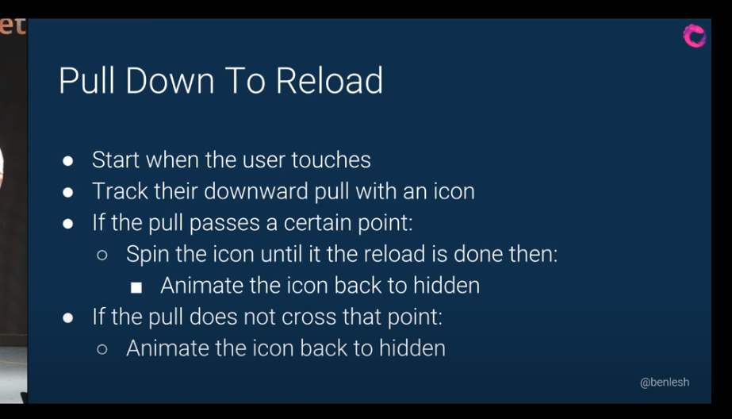
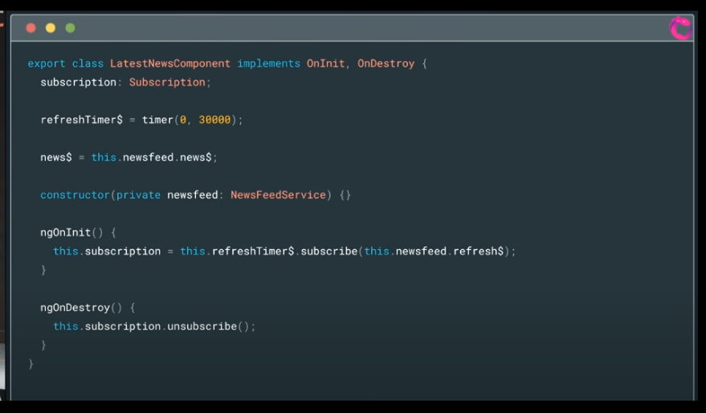
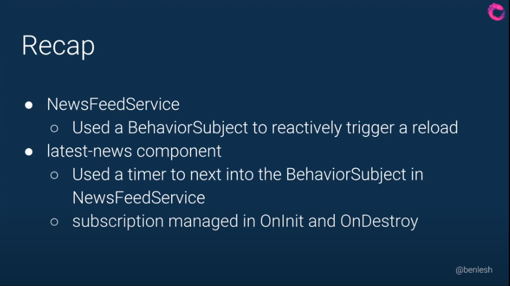

Very useful talk by Ben Lash (Lead Engineer) of RxJS Team of Google - Great to understand some of the key concepts and techniques of rx-js

**[youtube-link](https://www.youtube.com/watch?v=B-nFj2o03i8)**

#### The task-specification for this demo



#### The NewsFeedService where the API call was made


**BehaviourSubject** - Requires an initial value and emits the current value to new subscribers. One of the variants of the Subject is the BehaviorSubject. The BehaviorSubject has the characteristic that it stores the “current” value.
**BehaviourSubject** is both an Observer and and Observable

The **share()** operator is brought in here, so if we have multiple subscribers to this, it shares the one http request among them, untill the http request is done. So we dont expand the server whole bunch.

#### Context as to why `share()` operator is needed in the above code

Because by default, **Observables** lazily instantiate their data flow, concretely initiating the dataflow when a subscriber subscribes. Subscribing to an observable will result in an upstream chain of subscriptions taking place. The last subscription leads to the execution of a function which will handle a source and emit its data to its observer.
When a second subscriber subscribes to the same observable, another new dataflow is started as if it is was the first subscriber. Meaning, each subscription creates a new chain of observables. This is what is coined in RxJS terminology as a **cold observable** and that's the default behaviour for RxJS observable. If you want an observable which sends (or shares) its data to all the subscribers it has at the moment the data arrives, that would be coined a **hot observable**, and one way to get a hot observable is to use the **share operator**.

`share` makes the observable "**hot**" if these 2 conditions are met:

1. The number of subscribers > 0
2. AND the observable has not completed

Scenario1: number of subscribers > 0 and observable is not completed before a new subscription





#### Component Code where the reload is controlled with `pageY`

```ts
refresh = new EventEmitter<any>()

private _pos = 0;

touchStart$ =  fromEvent<TouchEvent>(document, 'touchstart')
touchMove$ = fromEvent<TouchEvent>(document, 'touchmove')
touchEnd$ = fromEvent<TouchEvent>(document, 'touchend')

/* The touchmove event occurs when the user moves the finger across the screen. The touchmove event will be triggered once for each movement, and will continue to be triggered until the finger is released.
 */

touchDrag$ = this.touchStart$.pipe(
  exhaustMap(start => {
    return concat(
      this.touchMove$.pipe(
        map(move => move.touches[0].pageY - start.touches[0].pageY),
        takeUntil(this.touchEnd$),
        tap(p => this._pos * p),
      ),
      this.moveHome$
    )
  }),
  tap(y => {
    if (y > window.innerHeight / 2) {
      this.refresh.emit()
    }
  })
  takeWhile(y => y <= window.innerHeight / 2)
)

/* tap - Perform a side effect for every emission on the source Observable, but return an Observable that is identical to the source.
 */

moveHome$ = defer(() => this.rxAnimation.tween(this._pos, 0, 200))

moveHomeAfterLoad$ = this.newsfeed.loadNews$.pipe(
  exhaustMap(() => this.moveHome$)
)

/* The below functions effectively saying,
1. Take touchDrag$
2. And when touchDrag is done then start moveHomeAfterLoad$ observable
3. And moveHomeAfterLoad$ observable will wait till loadNews$ observable is done
4. Thats why we have to add repeat() - Bcz Observable are lazy, so we have to subscribe to them again when they are done.
 */
positionUpdate$ = concat(
  this.touchDrag$,
  this.moveHomeAfterLoad$,
).pipe(
  repeat()
)


positions$ = this.touchDrag$.pipe(
  startWith(0),
  map(y => y - 70)
)

```

**concat() method** - concat joins multiple Observables together, by subscribing to them one at a time and merging their results into the output Observable. You can pass either an array of Observables, or put them directly as arguments. Passing an empty array will result in Observable that completes immediately. So concat() basically means, play the first observable till its done, then play next observable

**exhaustMap() method** - Projects each source value to an Observable which is merged in the output Observable only if the previous projected Observable has completed. So in the above code

```js
this.touchMove$.pipe(
  map((move) => move.touches[0].pageY - start.touches[0].pageY),
  takeUntil(this.touchEnd$),
  tap((p) => this._pos * p),
)
```

So in the above code it says, do the touchMovements until touchEnd and ONLY then do moveHome (which will play the rxAnimation)
