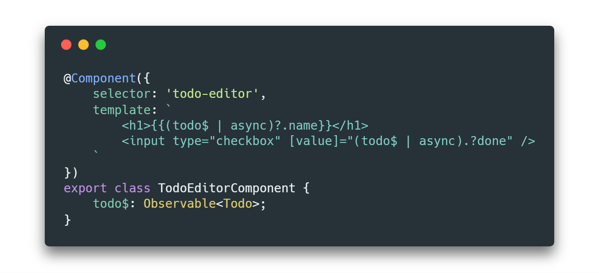

### Async | Pipe

#### Short ANS we DONT'T need to unsubscribe when using async pipe.

```js
export class AsyncPipeCardComponent implements OnInit {
  messageSubscription: Observable<string>;
  constructor(private upperCaseService: UpperCaseService) {}
 
  ngOnInit() {
    this.messageSubscription = this.upperCaseService.getUpperCaseMessage();
  }
}
  
```
Then in the template 

```html
    <h4 class="card-title">{{messageSubscription | async}}</h4>
```

The async pipe subscribes to an Observable or Promise and returns the latest value it has emitted. When a new value is emitted, the async pipe marks the component to be checked for changes. 

#### When the component gets destroyed, the asyncpipe automatically unsubscribes  all active subscriptions to avoid potential memory leaks.

Using the async pipe is a huge advantage if we are using Observables in our components because it will subscribe to them and unsubscribe from them. We will not be bothered about forgetting to unsubscribe from them in ngOnDestroy when the component is being killed off.


Another big advantage of using | async pipe together with *ngIf directive is that we can guarantee that the unwrapped value will be available to all child components at the time they are rendered.
Such an approach helps us to prevent excessive use of “elvis” operator (?.)in our templates which is used to get rid prop of undefined errors...

Without <ng-container> it would look more like this…



As a conclusion 

we should always use async pipe when possible and only use .subscribe when the side effect is an absolute necessity as we are safe as long as we stay in the observable. The code terminating the observable should be the framework (Angular) and the last piece (the UI). 

A real life example 


In above case I really dont need to unsubscribe. Instead transforming the params object to the `character` list using the `switchMap` operator. And  managing the subscription imperatively by unwrapping it in the template with the async pipe.

Create your character observable.

```js
this.characters$ = this.activatedRoute.params
  .pipe(switchMap(parms => this.fetchCharactersByBook(parms.bookId)));
```
The dollar $ is a convention to know that the variable is observable. 

Once the observable is created, then to display from the UI, we would need to use the async pipe. 
Will need to use the **async pipe** to unwrap it by replacing template references (i.e. in .html file) to `characters list` directly with

`characters$ | async`

The component will dispose of the `characters$`` observable as part of the tear down process.

#### Another example

```js
costs$: Observable<Cost[]>;
ngOnInit() {
    this.costs$ = this.getCosts()
        .combineLatest(this.getFilter())
        .map(([costs, filter]) => costs.filter(e => e.type === filter));
}
```

Then to display from the UI, we would need to use the async pipe.

`{{ costs$ | async }}``


[https://medium.com/isop-nepal/subscribe-vs-async-pipe-in-angular-21bb38f3ee49](https://medium.com/isop-nepal/subscribe-vs-async-pipe-in-angular-21bb38f3ee49)