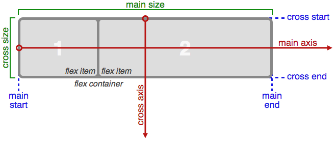

### What exactly is Flexbox -

The Flexbox Layout (Flexible Box) module aims at providing a more efficient way to lay out, align and distribute space among items in a container, even when their size is unknown and/or dynamic (thus the word "flex").

### Container and Items

In flexbox we have a container and it’s items. These are the two components of any flexbox component. Any html element that is a direct child of the flexbox container, becomes a flexbox item.

The main idea behind the flex layout is to give the container the ability to alter its items' width/height (and order) to best fill the available space (mostly to accommodate to all kind of display devices and screen sizes). A flex container expands items to fill available free space, or shrinks them to prevent overflow.

Most importantly, the flexbox layout is direction-agnostic as opposed to the regular layouts (block which is vertically-based and inline which is horizontally-based). While those work well for pages, they lack flexibility to support large or complex applications (especially when it comes to orientation changing, resizing, stretching, shrinking, etc.).

A good example of turning a block to a flex-box design for few div elements - [https://vegibit.com/css-flexbox-tutorial/](https://vegibit.com/css-flexbox-tutorial/)

### Note: Flexbox layout is most appropriate to the components of an application, and small-scale layouts, while the Grid layout is intended for larger scale layouts.

Source - https://css-tricks.com/snippets/css/a-guide-to-flexbox/

### A Flexible Layout must have a parent element with the display property set to flex. Like below

```
.flex-container {
  display: flex;
}
```

Note, this is the only property you need to set on the parent container and all its immediate children will become automatically flex items.

And then this is how generally it works - I need to add **display:flex** to the parent tag for and then **flex:1** to the child to enable the child to expand to 100% of parent.

```js
.fb-container {
  background-color:green;
  flex: 1;

}
.somedatadiv {
  width: 75%;
  max-width: 345px;
  background-color: grey;
  padding: 30px;
}
<body style="height:100vh;display:flex;">
  <div class="fb-container">
    <div class="somedatadiv">
      Some data
    </div>
    <div class="anotherdiv">
      data
    </div>
  </div>
</body>
```

### An area of a document laid out using flexbox is called a flex container. To create a flex container, we set the value of the area's container's display property to flex or inline-flex. As soon as we do this the direct children of that container become flex items. As with all properties in CSS, some initial values are defined,

https://developer.mozilla.org/en-US/docs/Web/CSS/CSS_Flexible_Box_Layout/Basic_Concepts_of_Flexbox#The_flex_container

### Direct child elements(s) of the flexible container automatically becomes flexible items.

#### Basics & Terminology

Since flexbox is a whole module and not a single property, it involves a lot of things including its whole set of properties. Some of them are meant to be set on the container (parent element, known as "flex container") whereas the others are meant to be set on the children (said "flex items").

If regular layout is based on both block and inline flow directions, the flex layout is based on "flex-flow directions". Please have a look at this figure from the specification, explaining the main idea behind the flex layout.



### Implementation of flex-end

[https://github.com/rohan-paul/SignUp-Form-with-Passport/blob/master/src/App.css](https://github.com/rohan-paul/SignUp-Form-with-Passport/blob/master/src/App.css)

In the above running application -> do inspect element on the running app on Navbar login section -> In the devtool change 'flex-end' to 'flex-start' and I will see the <section className="navbar-section"> which **holds home login sign up** section will move vertically up to take the top left position of the navbar

https://developer.mozilla.org/en-US/docs/Web/CSS/CSS_Flexible_Box_Layout/Basic_Concepts_of_Flexbox#Start_and_end_lines

The items are packed flush to each other toward the edge of the alignment container depending on the flex container's **cross-end** side.
This only applies to flex layout items. For items that are not children of a flex container, this value is treated like end.
https://developer.mozilla.org/en-US/docs/Web/CSS/align-content#Formal_syntax

#### Good Sources for more detailed reading

1> https://www.w3schools.com/css/css3_flexbox.asp

2> https://developer.mozilla.org/en-US/docs/Web/CSS/CSS_Flexible_Box_Layout/Basic_Concepts_of_Flexbox

3> https://developer.mozilla.org/en-US/docs/Web/CSS/flex

4> https://vegibit.com/css-flexbox-tutorial/

5> https://scotch.io/tutorials/a-visual-guide-to-css3-flexbox-properties
