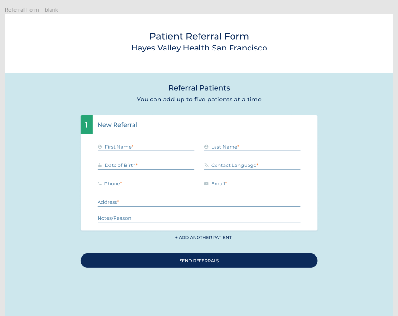
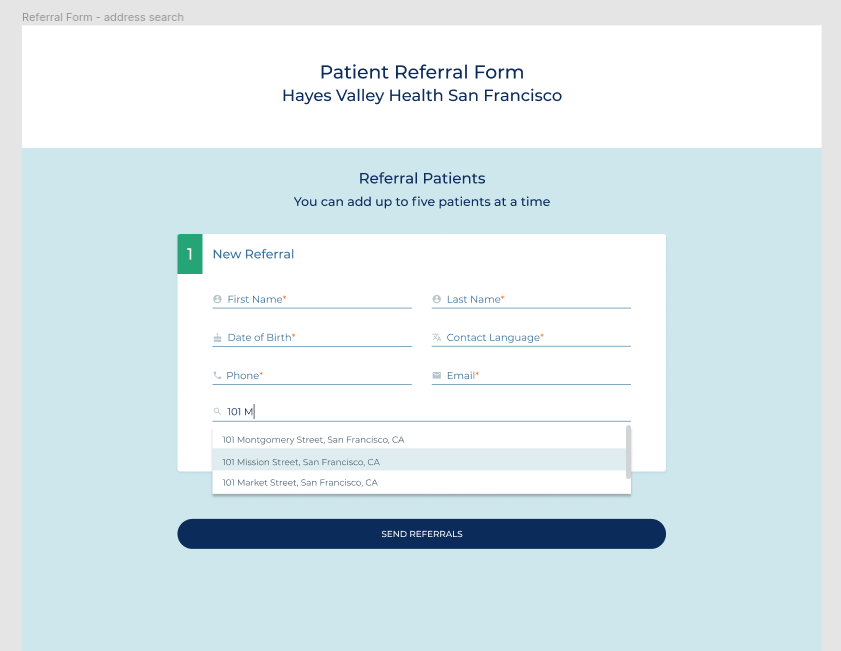
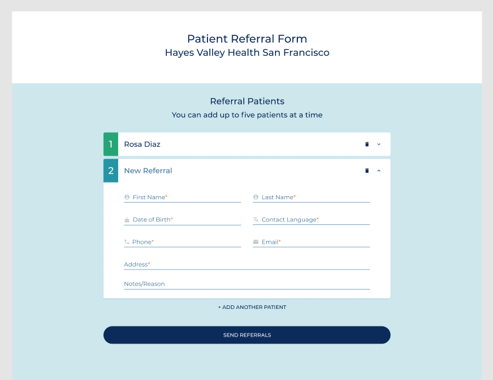
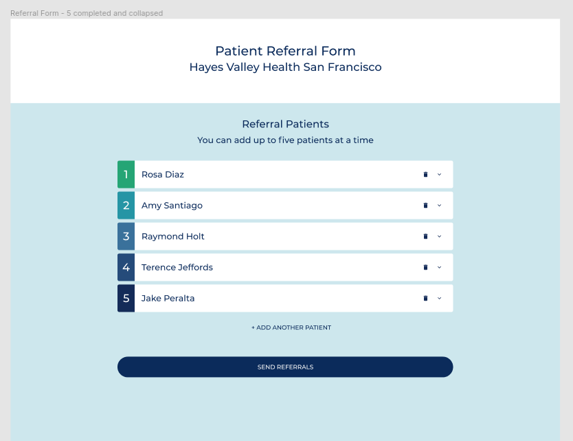
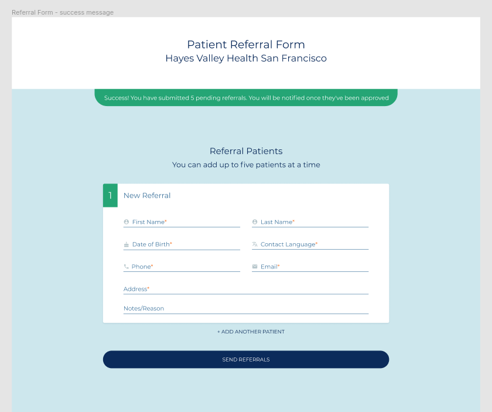

## Front End Engineering Interview

## Interview Task

Build the Patient Referral Form using this [design spec](https://www.figma.com/file/XIHFNbIXykq8KosWEIryhoRJ/Patient-Referral-Form---interview?node-id=0%3A1).

There is no need to build any backend (api layer, server, database). For simulating form submission, you can do a POST to /api/referrals

## Duration

Up to 8 hours. We do not expect you to complete the assessment in this time.

## Submission

1.  Fork this repo
2.  Build Patient Referral Form. Suggested libraries
    - Material UI components - [https://material-ui.com/](https://material-ui.com/)
    - Address lookup - [https://www.npmjs.com/package/react-places-autocomplete](https://www.npmjs.com/package/react-places-autocomplete)
3.  Submit a Pull Request (PR)
4.  In the PR, include a README that includes the following:
    - If you made any assumptions, what are they
    - Outline what else needs to be done if given more time

---

## In case the [Figma Link](https://www.figma.com/file/XIHFNbIXykq8KosWEIryhoRJ/Patient-Referral-Form---interview?node-id=0%3A1) Does NOT open here are the screenshots

