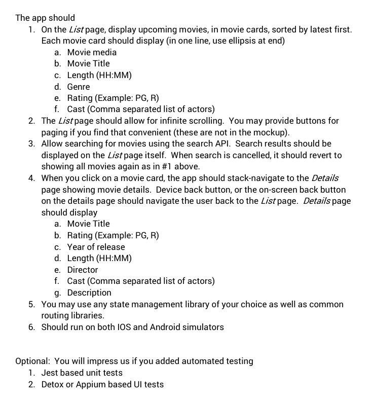
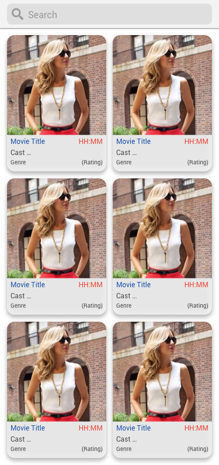
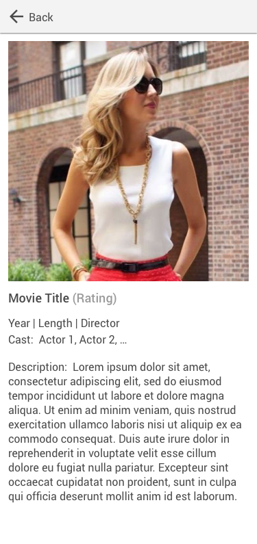

### Example of how the app may look like

### Evaluation Criteria

1. Design implemented according to attached files using React Components
2. Routing / Navigation implemented (List, Detail)
3. Connect to API - Movies retrieved, data parsed and presented in List and Detail
4. Connect to API - Search, search functionality is working
5. State Management
6. Handling of async operations
7. Performance
8. Code structuring for reusability, maintainability and testability
9. Optional – Automated tests
