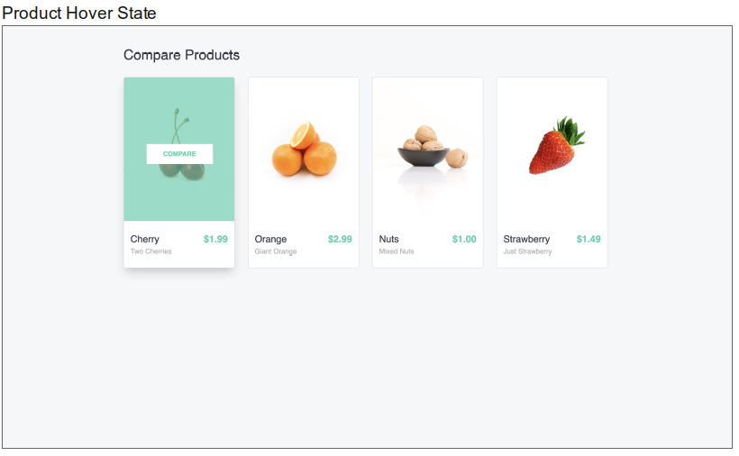
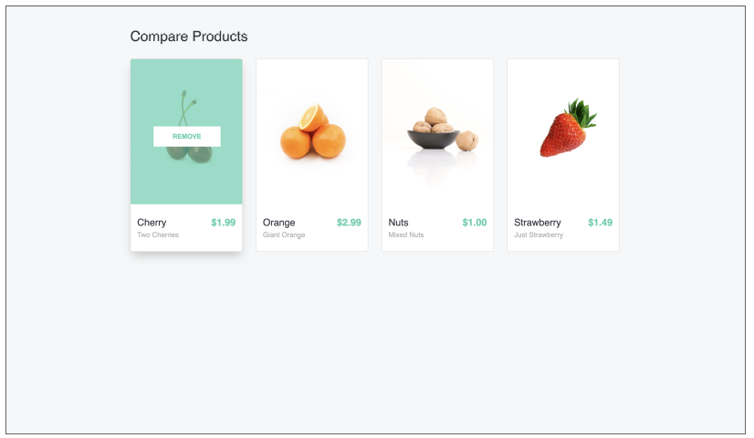

### Build a page to compare products:

Product Listing Page: (Product JSON data is available in the bottom of the document)




### When user clicks on Compare



#### When user clicks on 2 or more cards to compare


#### User can select what all attributes to compare


#### You should be able to search

### Expectations from our side :

    • Front end should be coded in React JS.
    • We expect your code to be efficient, concise, and extendable. Code should be in ready to deploy state.
    • A simple document that explains how to run the app.
    • Please push the code to Git/Bitbucket repository.

### Product JSON:

```
[{
      "id": "1",
      "name": "Cherry",
      "image": "images/Cherry.png",
      "price": "$1.99",
      "colors": ["red", "green", "blue"],
      "condition": "Fresh",
      "description": "Two Cherries",
      "vendors": ["Fresh Fruits Market", "Fruit Ninja"]
    },
    {
      "id": "2",
      "name": "Orange",
      "image": "images/Orange.png",
      "price": "$2.99",
      "colors": ["green", "blue"],
      "condition": "Frozen",
      "description": "Giant Orange",
      "vendors": ["Families Market"]
    },
    {
      "id": "3",
      "name": "Nuts",
      "image": "images/Nuts.png",
      "price": "$1.00",
      "colors": ["red"],
      "condition": "Frozen",
      "description": "Mixed Nuts",
      "vendors": ["Amazon Distributor"]
    },
    {
      "id": "4",
      "name": "Strawberry",
      "image": "images/Strawberry.png",
      "price": "$1.49",
      "colors": ["blue"],
      "condition": "Fresh",
      "description": "Just Strawberry",
      "vendors": ["Big Basket"]
    }
  ]
```
