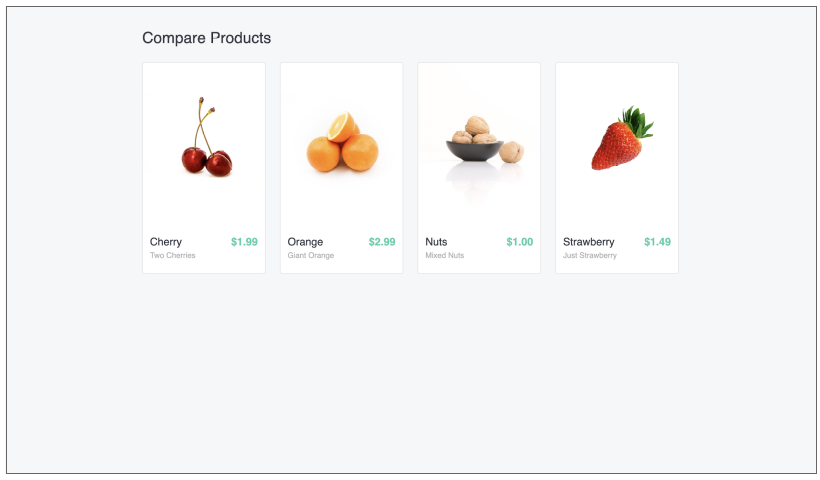
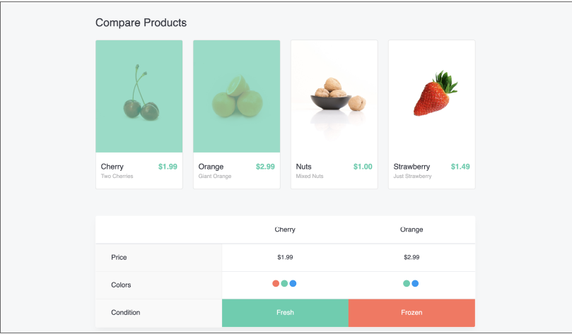
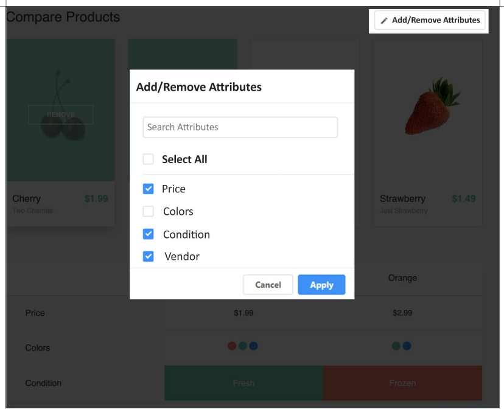

### Build a page to compare products:

Product Listing Page: (Product JSON data is available in the bottom of the document)

### When user clicks on Compare

#### When user clicks on 2 or more cards to compare

#### User can select what all attributes to compare

