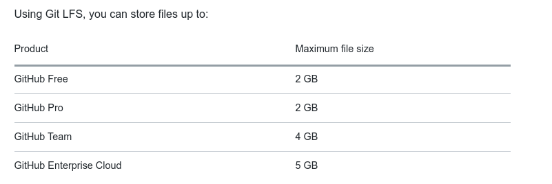

### IMPORTANT - Monthly bandwidth quota IS ONLY 1 GB.

Every account using Git Large File Storage receives 1 GB of free storage and 1 GB a month of free bandwidth.

---

### Install and upload

**Note, max size in normal github is only 100mb per file**

https://git-lfs.github.com/

[Download](https://github.com/git-lfs/git-lfs/releases/download/v2.13.2/git-lfs-linux-amd64-v2.13.2.tar.gz) and install the Git command line extension. Once downloaded and installed, set up Git LFS for your user account by running:

```
git lfs install

```

#### You only need to run this once per user account.

In each Git repository where you want to use Git LFS, select the file types you'd like Git LFS to manage (or directly edit your .gitattributes). You can configure additional file extensions at anytime.

```
git lfs track "*.csv"

```

Now make sure .gitattributes is tracked:

```
git add .gitattributes

```

Note that defining the file types Git LFS should track will not, by itself, convert any pre-existing files to Git LFS, such as files on other branches or in your prior commit history. To do that, use the git lfs migrate[1] command, which has a range of options designed to suit various potential use cases.

### There is no step three. Just commit and push to GitHub as you normally would; for instance, if your current branch is named main:

Means now just run `git c 'add large file'`

---

### Max size here

https://docs.github.com/en/github/managing-large-files/about-git-large-file-storage


