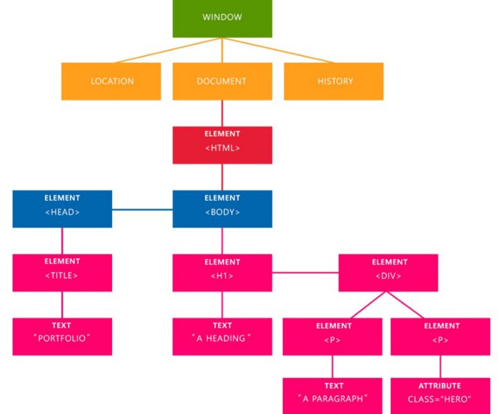
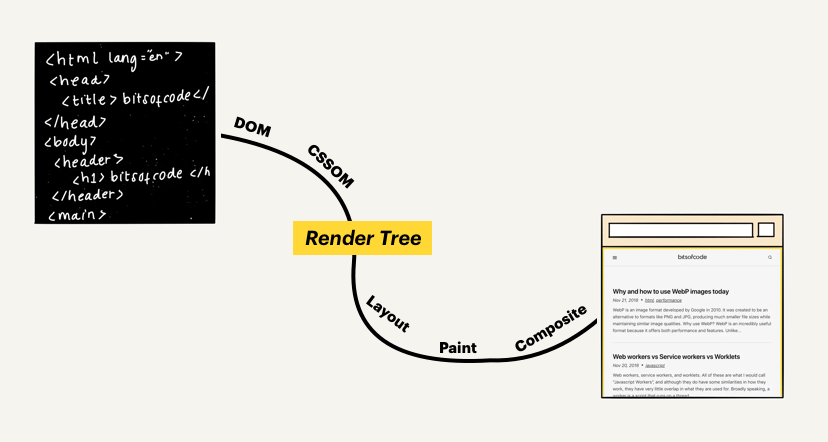
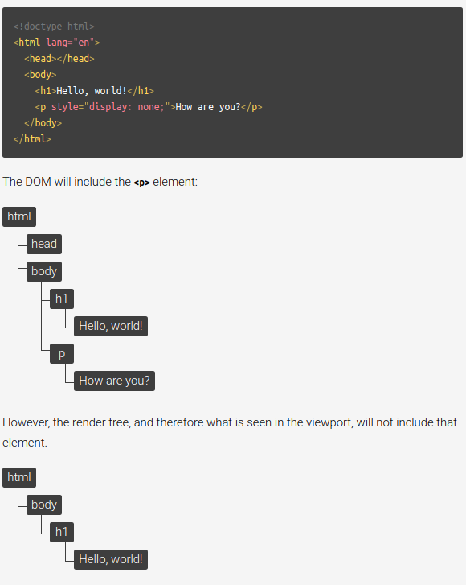

### What, exactly, is the DOM?

The Document Object Model, or the “DOM”, is an interface to web pages. It is essentially an API to the page, allowing programs to read and manipulate the page’s content, structure, and styles. Let’s break this down.

### How is a web page built?

How a browser goes from a source HTML document to displaying a styled and interactive page in the viewport is called the “Critical Rendering Path”. Although this process can be broken down into several steps, these steps can be roughly grouped into two stages. The first stage involves the browser parsing the document to determine what will ultimately be rendered on the page, and the second stage involves the browser performing the render.

The result of the first stage is what is called a “render tree”. The render tree is a representation of the HTML elements that will be rendered on the page and their related styles. In order to build this tree, the browser needs two things:

The CSSOM, a representation of the styles associated with elements
The DOM, a representation of the elements

### How is the DOM created (and what does it look like)?

The DOM is an object-based representation of the source HTML document. It has some differences, as we will see below, but it is essentially an attempt to convert the structure and content of the HTML document into an object model that can be used by various programs.

The object structure of the DOM is represented by what is called a “node tree”. It is so called because it can be thought of as a tree with a single parent stem that branches out into several child branches, each which may have leaves. In this case, the parent “stem” is the root <html> element, the child “branches” are the nested elements, and the “leaves” are the content within the elements.

Let’s take this HTML document as an example:

### The DOM is not what you see in the browser (i.e., the render tree)

What you see in the browser viewport is the render tree which, as I mentioned, is a combination of the DOM and the CSSOM. What really separates the DOM from the render tree, is that the latter only consists of what will eventually be painted on the screen.

Because the render tree is only concerned with what is rendered, it excludes elements that are visually hidden. For example, elements that have display: none styles associated to them.

### The DOM is not what is in DevTools

This difference is a bit more minuscule because the DevTools element inspector provides the closest approximation to the DOM that we have in the browser. However, the DevTools inspector includes additional information that isn’t in the DOM.

The best example of this is CSS pseudo-elements. Pseudo-elements created using the ::before and ::after selectors form part of the CSSOM and render tree, but are not technically part of the DOM. This is because the DOM is built from the source HTML document alone, not including the styles applied to the element.

Despite the fact that pseudo-elements are not part of the DOM, they are in our devtools element inspector.

### This is why pseudo-elements cannot be targetted by Javascript, because they are not part of the DOM.

#### More Resources to Read
[https://bitsofco.de/what-exactly-is-the-dom/](https://bitsofco.de/what-exactly-is-the-dom/)
