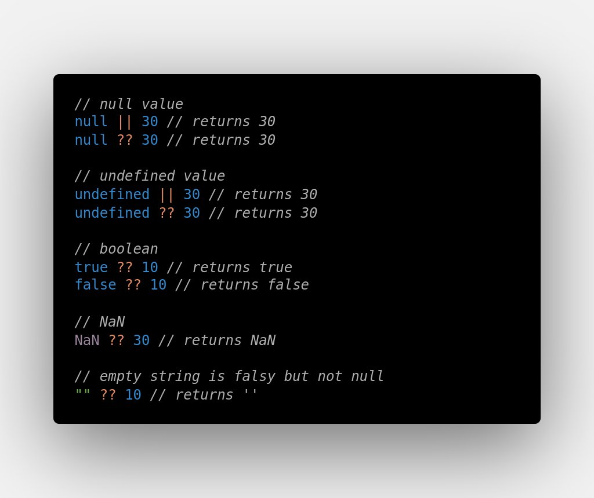

### The Null-Coalescing operator (??), provides a default value if the evaluated value is either undefined or null

#### Use it when you do not want to return an undefined or null from a function for statement and instead want to return a default value in case of 'undefined' or 'null'. But if the return value is just a falsy value like and empty string "" - then return that empty string and NOT the default value.

So with Null-Coalescing, we can truly deal with situation of ONLY `undefined` or `null` while seperating out the falsy values.

let's use it in our example:

#### Firt the case without Null-Coalescing opereator

```ts
let networkFetchResult = await fetch("https://myfriends.com/user/123").then(res => res.json());

let bestFriendsName = networkFetchResult?.data?.user?.friends?.[0]?.name || "You don't have any friends!";
```

Wow, our code is instantly at lot cleaner, but still quite safe. If our fetched user has a best friend, we get their name, or we get our supplied default fallback value. So in no situation I am returning an `undefined` from this function.

And all we have to do is use the optional dot notation operator, ?. instead of regular dot notation. Something that's really awesome about this new syntax is that you can see it also works on array indices as well, so we can safely access array indexes that might also be non-existent.

#### Now using Null-Coalescing

```ts
let networkFetchResult = await fetch("https://myfriends.com/user/123").then(res => res.json());
let bestFriendsName = networkFetchResult?.data?.user?.friends?.[0]?.name ?? "You don't have any friends!";
```

#### The difference is that the new operator, ??, is that it only provides a default value if the evaluated value is either undefined or null


