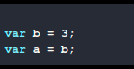

#### Q - What will be the output of the below code and why

#### Ans - if you are not using strict mode), the output of the code snippet would be:

### Explanations

Since both a and b are defined within the enclosing scope of the function, and since the line they are on begins with the var keyword, most JavaScript developers would expect typeof a and typeof b to both be undefined in the above example.

However, that is not the case. The issue here is that most developers incorrectly understand the statement var a = b = 3; to be shorthand for:

But in fact, var a = b = 3; is actually shorthand for:

As a result (if you are not using strict mode), the output of the code snippet would be:

But how can b be defined outside of the scope of the enclosing function? Well, since the statement var a = b = 3; is shorthand for the statements b = 3; and var a = b;, b ends up being a global variable (since it is not preceded by the var keyword) and is therefore still in scope even outside of the enclosing function.

Note that, in strict mode (i.e., with use strict), the statement var a = b = 3; will generate a runtime error of ReferenceError: b is not defined, thereby avoiding any headfakes/bugs that might othewise result. (Yet another prime example of why you should use use strict as a matter of course in your code!)
