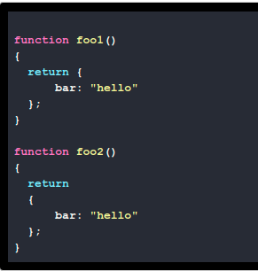
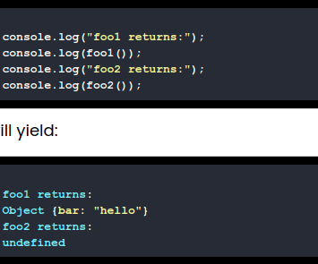

#### Q - Will below 2 functions return same thing

### Ans -

Surprisingly, these two functions will not return the same thing. Rather:

#### Explanation

Not only is this surprising, but what makes this particularly gnarly is that foo2() returns undefined without any error being thrown.

The reason for this has to do with the fact that semicolons are technically optional in JavaScript (although omitting them is generally really bad form). As a result, when the line containing the return statement (with nothing else on the line) is encountered in foo2(), a semicolon is automatically inserted immediately after the return statement.

No error is thrown since the remainder of the code is perfectly valid, even though it doesn’t ever get invoked or do anything (it is simply an unused code block that defines a property bar which is equal to the string "hello").

This behavior also argues for following the convention of placing an opening curly brace at the end of a line in JavaScript, rather than on the beginning of a new line. As shown here, this becomes more than just a stylistic preference in JavaScript.
