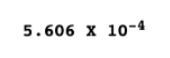
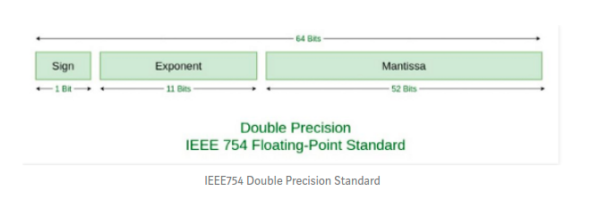
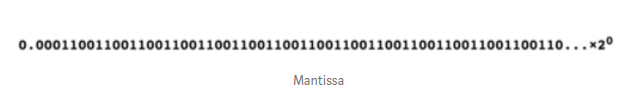

Question: Why `.1+.2 != .3`

**Answer:** This is not a javascript only limitation, it applies to all floating point calculations. The problem is that 0.1 and 0.2 and 0.3 are not exactly representable as javascript (or C or Java etc) floats. Thus the output you are seeing is due to that inaccuracy.

In particular only certain sums of powers of two are exactly representable. 0.5 = =0.1b = 2^(-1), 0.25=0.01b=(2^-2), 0.75=0.11b = (2^-1 + 2^-2) are all OK. But 1/10 = 0.000110001100011..b can only be expressed as an infinite sum of powers of 2, which the language chops off at some point. Its this chopping that is causing these slight errors.

---

### Why is 0.1 + 0.2 Not Equal to 0.3 in Most Programming Languages?

---

### Problem statement: How is it that 0.1 + 0.2 = 0.30000000000000004?

if you have done programming in languages like Java or C, you must be aware of different data types used to store values. The two data types we would be considering in the discussion ahead are integer and float.

Integer data types store whole numbers, while float data types store fractional numbers.
Before we proceed, let’s understand one small concept: How are numbers represented for computational purposes? Very small and very large numbers are usually stored in scientific notation. They are represented as:

Also, a number is normalized when it is written in scientific notation with one nonzero decimal digit before the decimal point. For example, a number 0.0005606 in scientific notation and normalized will be represented as:

Significant is the number of significant digits which do not include zeroes, and base represents the base system used — which is decimal(10) here. Exponent represents the number of places the radix point needs to be moved left or right to be represented correctly.

Now, there are two ways to display numbers in floating point arithmetic: single precision and double precision. Single precision uses 32 bits, and double precision uses 64 bits for floating-point arithmetic.

Unlike many other programming languages, JavaScript does not define different types of numeric data types and always stores numbers as double precision floating point numbers, following the international IEEE 754 standard.
This format stores numbers in 64 bits, where the number (the fraction) is stored in bits 0 to 51, the exponent in bits 52 to 62, and the sign in bit 63.

Let’s represent 0.1 in 64 bit following the IEEE754 standard.
The first step is converting (0.1)base 10 to its binary equivalent (base 2).
To do so, we will start by multiplying 0.1 by 2 and will separate out the digit before the decimal to get the binary equivalent.

On repeating this for 64 bits, we are going to arrange them in ascending order to get our mantissa, which we are going to round off to 52 bits as per the double precision standard.

Representing it in scientific form and rounding off to the first 52 bits will yield:

