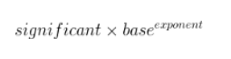

Question: Why `.1+.2 != .3`

**Answer:** This is not a javascript only limitation, it applies to all floating point calculations. The problem is that 0.1 and 0.2 and 0.3 are not exactly representable as javascript (or C or Java etc) floats. Thus the output you are seeing is due to that inaccuracy.

In particular only certain sums of powers of two are exactly representable. 0.5 = =0.1b = 2^(-1), 0.25=0.01b=(2^-2), 0.75=0.11b = (2^-1 + 2^-2) are all OK. But 1/10 = 0.000110001100011..b can only be expressed as an infinite sum of powers of 2, which the language chops off at some point. Its this chopping that is causing these slight errors.

---

### Why is 0.1 + 0.2 Not Equal to 0.3 in Most Programming Languages?

---

### Problem statement: How is it that 0.1 + 0.2 = 0.30000000000000004?

if you have done programming in languages like Java or C, you must be aware of different data types used to store values. The two data types we would be considering in the discussion ahead are integer and float.
Integer data types store whole numbers, while float data types store fractional numbers.
Before we proceed, let’s understand one small concept: How are numbers represented for computational purposes? Very small and very large numbers are usually stored in scientific notation. They are represented as:

