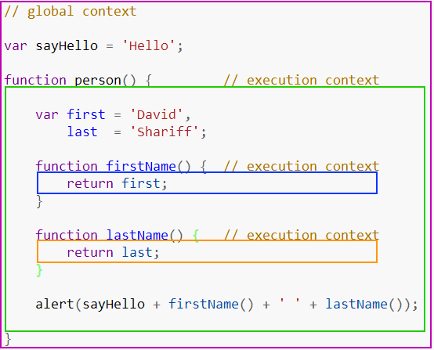

## What is the Execution Context?

## Execution context is a concept in the language spec that roughly equates to the 'environment' a function executes in; that is, variable scope (and the scope chain, variables in closures from outer scopes), function arguments, and the value of the this object.

## The call stack is a collection of execution contexts.

An Execution Context is created each time you run your .js file/app. The first step in this creation phase is Hoisting. The JS Engine reserves space or set's up memory for all the variables and functions defined in your code. These are then accessed when your code is executed line-by-line.

When code is run in JavaScript, the environment in which it is executed is very important, and is evaluated as 1 of the following:

Global code – The default envionment where your code is executed for the first time.

Function code – Whenever the flow of execution enters a function body.

Eval code – Text to be executed inside the internal eval function.

#### Think of the term execution context as the environment / scope the current code is being evaluated in.



### I have 1 global context represented by the purple border and 3 different function contexts represented by the green, blue and orange borders. There can only ever be 1 global context, which can be accessed from any other context in your program.

### You can have any number of function contexts, and each function call creates a new context, which creates a private scope where anything declared inside of the function can not be directly accessed from outside the current function scope. In the example above, a function can access a variable declared outside of its current context, but an outside context can not access the variables / functions declared inside. Why does this happen? How exactly is this code evaluated?

### As we already know, when a browser first loads your script, it enters the global execution context by default. If, in your global code you call a function, the sequence flow of your program enters the function being called, creating a new execution context and pushing that context to the top of the execution stack.

### If you call another function inside this current function, the same thing happens. The execution flow of code enters the inner function, which creates a new execution context that is pushed to the top of the existing stack. The browser will always execute the current execution context that sits on top of the stack, and once the function completes executing the current execution context, it will be popped off the top of the stack, returning control to the context below in the current stack.

## Scope is literally that: the scope in which a variable can be accessed. Simplistically:

```js
var x

function a() {
  var y
}
```

x can be accessed from anywhere. When a is invoked, x will be in the outer scope. (Stored in the scope chain.)

In contrast, y can only be accessed by code in a() because it is limited to a's scope. This is what the var keyword does: restricts a variable to the local scope. If we omitted var, y would end up in the global scope, generally considered a bad thing.
