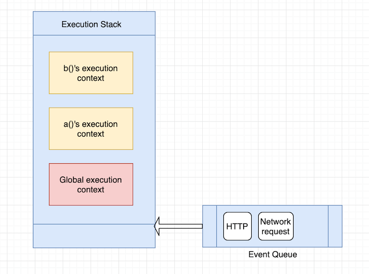

First note from [Official MDN Doc](https://developer.mozilla.org/en-US/docs/Web/API/WindowOrWorkerGlobalScope/setTimeout)

**Code executed by setTimeout() is called from an execution context separate from the function from which setTimeout was called. The usual rules for setting the `this` keyword for the called function apply, and if you have not set `this` in the call or with bind, it will default to the global (or window) object in non–strict mode, or be undefined in strict mode. It will not be the same as the `this` value for the function that called setTimeout.**

Whenever you write a function in JavaScript, the JS engine creates what we call function execution context. Also, each time the JS engine begins, it creates a global execution context that holds the global objects — for example, the window object in the browser and the global object in Node.js. Both these contexts are handled in JS using a stack data structure also known as the execution stack.

So, when you write something like this:

```js
function a() {
  console.log("i am a")
  b()
}

function b() {
  console.log("i am b")
}

a()
```

The JavaScript engine first creates a global execution context and pushes it into the execution stack. Then it creates a function execution context for the function a(). Since b() is called inside a(), it will create another function execution context for b() and push it into the stack.

When the function b() returns, the engine destroys the context of b(), and when we exit function a(), the context of a() is destroyed. The stack during execution looks like this:


But what happens when the browser makes an asynchronous event like an HTTP request? Does the JS engine stock the execution stack and handle the asynchronous event, or wait until the event completes?

**The JS engine does something different here. On top of the execution stack, the JS engine has a queue data structure, also known as the event queue. The event queue handles asynchronous calls like HTTP or network events coming into the browser.**



The way the JS engine handles the stuff in the **event queue** is by waiting for the **main execution stack** to become empty. So each time the **main execution stack**becomes empty, the JS engine checks the event queue, pops items off the queue, and handles that event. It is important to note that the JS engine checks the event queue only when the execution stack is empty or the only item in the execution stack is the global execution context.

#### Further Reading

[https://blog.logrocket.com/deep-dive-into-react-fiber-internals/](https://blog.logrocket.com/deep-dive-into-react-fiber-internals/)
