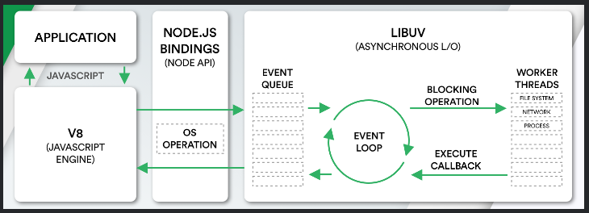

## Q. **_How do Node.js works?_**

Node is completely event-driven. Basically the server consists of one thread processing one event after another.

A new request coming in is one kind of event. The server starts processing it and when there is a blocking IO operation, it does not wait until it completes and instead registers a callback function. The server then immediately starts to process another event (maybe another request). When the IO operation is finished, that is another kind of event, and the server will process it (i.e. continue working on the request) by executing the callback as soon as it has time.

So the server never needs to create additional threads or switch between threads, which means it has very little overhead. If you want to make full use of multiple hardware cores, you just start multiple instances of node.js

Node JS Platform does not follow Request/Response Multi-Threaded Stateless Model. It follows Single Threaded with Event Loop Model. Node JS Processing model mainly based on Javascript Event based model with Javascript callback mechanism.

**Single Threaded Event Loop Model Processing Steps:**

- Clients Send request to Web Server.
- Node JS Web Server internally maintains a Limited Thread pool to provide services to the Client Requests.
- Node JS Web Server receives those requests and places them into a Queue. It is known as “Event Queue”.
- Node JS Web Server internally has a Component, known as “Event Loop”. Why it got this name is that it uses indefinite loop to receive requests and process them.
- Event Loop uses Single Thread only. It is main heart of Node JS Platform Processing Model.
- Even Loop checks any Client Request is placed in Event Queue. If no, then wait for incoming requests for indefinitely.
- If yes, then pick up one Client Request from Event Queue
  - Starts process that Client Request
  - If that Client Request Does Not requires any Blocking IO Operations, then process everything, prepare response and send it back to client.
  - If that Client Request requires some Blocking IO Operations like interacting with Database, File System, External Services then it will follow different approach
    - Checks Threads availability from Internal Thread Pool
    - Picks up one Thread and assign this Client Request to that thread.
    - That Thread is responsible for taking that request, process it, perform Blocking IO operations, prepare response and send it back to the Event Loop
    - Event Loop in turn, sends that Response to the respective Client.

    <b><a href="#">↥ back to top</a></b>

