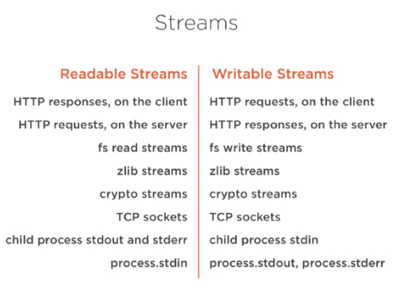

## What are Streams?


Streams are collections of data — just like arrays or strings. The difference is that streams might not be available all at once, and they don’t have to fit in memory. This makes streams really powerful when working with large amounts of data, or data that’s coming from an external source one chunk at a time.

However, streams are not only about working with big data. They also give us the power of composability in our code. Just like we can compose powerful linux commands by piping other smaller Linux commands, we can do exactly the same in Node with streams.

Ans. Typically, Stream is a mechanism for transferring data between two points. Node.js provides you streams
to read data from the source or to write data to the destination. In Node.js, Streams can be readable, writable, or
both and all streams are instances of EventEmitter class.

Streams are unix pipes that let you easily read data from a source and pipe it to a destination. Simply put, a stream is nothing but an EventEmitter and implements some specials methods. Depending on the methods implemented, a stream becomes Readable, Writable, or Duplex (both readable and writable). Readable streams let you read data from a source while writable streams let you write data to a destination.

If you have already worked with Node.js, you may have come across streams.
#### For example, in a Node.js based HTTP server, request is a readable stream and response is a writable stream. You might have used fs module which lets you work with both readable and writable file streams.


```js
var http = require('http');
var server = http.createServer(function (req, res) {
    // here, req is a readable stream
    // here, res is a writable stream
});
```


## What are the different types of Streams?

Node.js supports four types of streams as given below:

### Readable - Used for read operation.

### Writable - Used for write operation.

### Duplex - Used for both read and write operations. Both operations are independent and each have separate internal buffer.

### Transform - A type of duplex stream where the output is computed based on input. Both operations are linked via some transform.


### Many of the built-in modules in Node implement the streaming interface:



The list above has some examples for native Node.js objects that are also readable and writable streams. Some of these objects are both readable and writable streams, like TCP sockets, zlib and crypto streams.

Notice that the objects are also closely related. While an HTTP response is a readable stream on the client, it’s a writable stream on the server. This is because in the HTTP case, we basically read from one object (http.IncomingMessage) and write to the other (http.ServerResponse).


## [Using fs.createWriteStream()](https://stackabuse.com/writing-to-files-in-node-js/)

When handling particularly large files, or files that come in chunks, say from a network connection, using streams is preferable to writing files in one go via the above methods that write entire files.

Streams write small amounts of data at a time. While this has the disadvantage of being slower because data is transferred in chunks, it has advantages for RAM performance. Since the whole file is not loaded in memory all at once, RAM usage is lower.

To write to a file using streams, you need to create a new writable stream. You can then write data to the stream at intervals, all at once, or according to data availability from a server or other process, then close the stream for good once all the data packets have been written.

```js
const fs = require('fs');

const writeStream = fs.createWriteStream('secret.txt');

// write some data with a base64 encoding
writeStream.write('aef35ghhjdk74hja83ksnfjk888sfsf', 'base64');

// the finish event is emitted when all data has been flushed from the stream
writeStream.on('finish', () => {
    console.log('wrote all data to file')
})

writeStream.end();

```

We created a writable stream, then wrote some data to the stream. We have included a log statement when the "finish" event is emitted, letting us know that all data has been flushed to the underlying system. In this case, that means all data has been written to the file system.


### Further Reading

1> [https://www.sitepoint.com/basics-node-js-streams/](https://www.sitepoint.com/basics-node-js-streams/)

2> [https://medium.freecodecamp.org/node-js-streams-everything-you-need-to-know-c9141306be93](https://medium.freecodecamp.org/node-js-streams-everything-you-need-to-know-c9141306be93)

3>