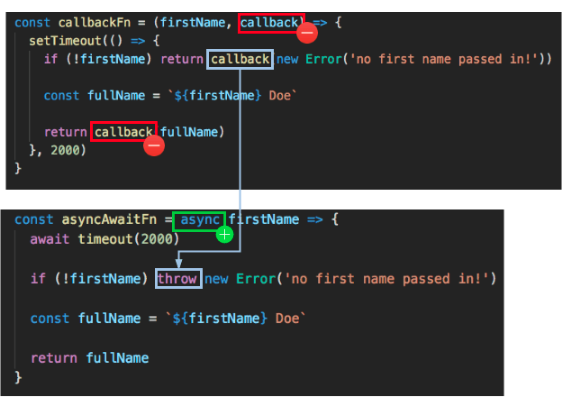

First note, - **Await works only with Promises, it does not work with callbacks. So to implement async-await to a function/code, I first have to convert the callback to a Promise **

Fist let's take the simplest of example. `setTimeout` is a straightforward browser API that waits for a specified period of time and then executes a callback. A standard use looks like this:

```js
function doStuff() {
  /_..._/;
}

setTimeout(doStuff, 300);
```

A Promise-based API for this function would likely look something like this code.

`timeout(300).then(doStuff)`

We can create an API like that using setTimeout. To do that, we’ll need a function timeout which takes a timeout variable and returns a Promise.

You can define A+ compliant Promises using the Promise constructor, which expects a single function as an argument. That function takes 2 arguments (both are callbacks), a resolve function and a reject function. The wonderful thing is that under the covers these are just callback functions that the Promise api glosses over.

```js
function timeout(delay) {
  return new Promise(function(resolve, reject) {
    setTimeout(resolve, delay);
  });
}
```

We don’t use the reject callback, since setTimeout doesn’t provide any hooks for an error state. So we pass resolve as the callback to setTimeout, and that is all we need. Now we have a great chainable setTimeout function that we could include in a Promise chain.

##### Now lets do a slightly more complicated version of the same exercise

[Source Code](https://github.com/coreyc/converting-callbacks/blob/master/index.js)

### Callback version

```js
const callbackFn = (firstName, callback) => {
  setTimeout(() => {
    if (!firstName) return callback(new Error("no first name passed in!"));

    const fullName = `${firstName} Doe`;

    return callback(fullName);
  }, 2000);
};

callbackFn("John", console.log);
callbackFn(null, console.log);
```

We're using the setTimeout() function in order to make our function asynchronous. In addition to setTimeout(), other asynchronous operations you're likely to see in the real-world are: AJAX and HTTP calls, database calls, filesystem calls (in the case of Node, if no synchronous version exists), etc.

In this function, we "reject" it if the first name argument is null. When we do pass in the firstName argument, the callback function (almost always the last argument in a callback-based function's argument list) gets called and returns our value after the 2 seconds set in setTimeout().

### Promise version - And here's the Promise-based version of that function:

```js
const promiseFn = firstName => {
  return new Promise((resolve, reject) => {
    setTimeout(() => {
      if (!firstName) reject(new Error("no first name passed in!"));

      const fullName = `${firstName} Doe`;

      resolve(fullName);
    }, 2000);
  });
};

promiseFn("Jane").then(console.log);
promiseFn().catch(console.log);
```

Converting to a Promise-based function is actually pretty simple. Look at the below diagram for a visual explanation:


First, we remove the callback argument. Then we add the code to return a new Promise from our Promise-based function. The error callback becomes a reject, while the "happy path" callback becomes a resolve. Promise returning functions should never throw, they should return rejections instead. Throwing from a promise returning function will force you to use both a } catch { and a .catch. People using promisified APIs do not expect promises to throw.

Remember, Promise expects a single function as an argument. That function takes 2 arguments (both are callbacks), a resolve function and a reject function.

**When we call the promiseFn, the result from the happy path will show up in the .then(), while the error scenario will show up in the .catch()**

The great thing about having our function in Promise form is that we don't actually need to "make it an async/await version" if we don't want to. When we call/execute the function, we can simply use the async/await keyword, like so:

(Remember - **Await works only with Promises, it does not work with callbacks. So to implement async-await to a function/code, I first have to convert the callback to a Promise **)

```js
const result = (async () => {
  try {
    console.log(await promiseFn("Jim"));
  } catch (e) {
    console.log(e);
  }

  try {
    console.log(await promiseFn());
  } catch (e) {
    console.log(e);
  }
})();
```

Side note: here I wrapped the function call in an IIFE (IIFE = "Immediately Invoked Function Execution") This is simply because we need to wrap the await call in a function that uses the async keyword. Here, there are no callbacks, no .then()'s or .catch()'s, we just use a try/catch block and call the promiseFn(). Promise rejections will be caught by the catch block.

### async/await version

But what if we wanted to convert a callback function directly to an async/await version of that function? Without using Promises directly?

```js
const timeout = ms => {
  return new Promise(resolve => setTimeout(resolve, ms));
};

const asyncAwaitFn = async firstName => {
  await timeout(2000); // using timeout like this makes it easier to demonstrate callback -> async/await conversion

  if (!firstName) throw new Error("no first name passed in!");

  const fullName = `${firstName} Doe`;

  return fullName;
};

const res = (async () => {
  try {
    console.log(await asyncAwaitFn("Jack"));
  } catch (e) {
    console.log(e);
  }

  try {
    console.log(await asyncAwaitFn());
  } catch (e) {
    console.log(e);
  }
})();
```

Use the below diagram to understand how to go from callback to async



Similar to converting to the Promise-based version, we get rid of the callback passed in to the original function, as well as that argument call within the body of the function. Next, we add the async keyword to the beginning of the function declaration. And finally, when we hit the error scenario, we throw an Error, which results in a rejected Promise (caught in the catch block when we call the function), and simply return the fullName in the happy path scenario.

Note that async functions all return Promises, so when you use return you are just resolving the Promise.

#### Further reading

1> https://benmccormick.org/2015/12/30/es6-patterns-converting-callbacks-to-promises

2> https://dev.to/ccleary00/how-to-rewrite-a-callback-function-in-promise-form-and-asyncawait-form-in-javascript-410e - This one is greate, 3 ways to convert a callback step-by-step to Promise and async-await.

3> https://medium.com/front-end-weekly/callbacks-promises-and-async-await-ad4756e01d90

4> https://tylermcginnis.com/async-javascript-from-callbacks-to-promises-to-async-await/
