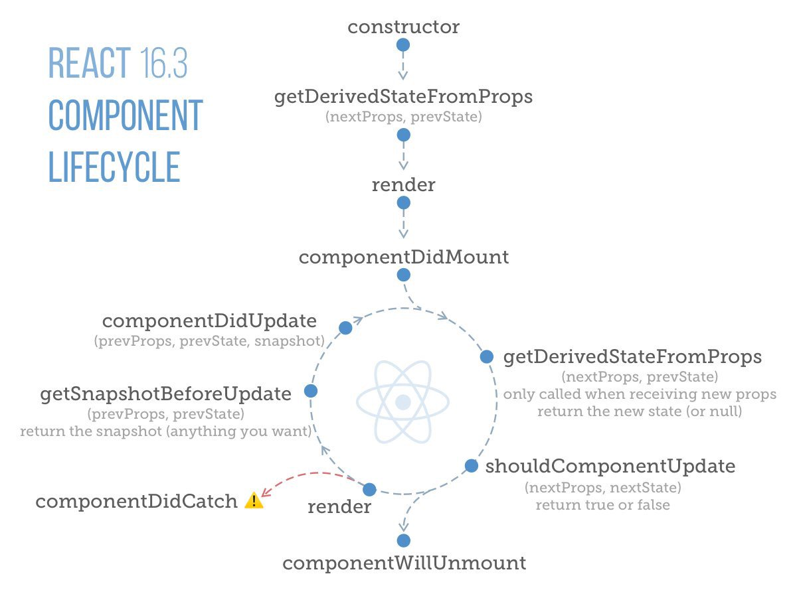

## React lifecycle cheatsheet

React’s life cycle events can be broken into two categories:

1. When a component gets mounted to the DOM or unmounted from it.

2. When a component receives new data.

For the first category, the component may need to perform some/all of the following tasks during that time in the life cycle:

* Default props - if props aren’t given to a component, they default to the specified Component.defaultProps object.

* Initial State - initial state is retrieved from within the constructor of the component

* Make an Ajax request to fetch some data - common use case, the request can be made in the body of componentDidMount method

* Set up or remove any listeners or web-sockets (like a firebase ref listener) - start listener within componentDidMount and stop listener in componentWillUnmount

### Mounting - After preparing with basic needs, state and props, our React Component is ready to mount in the browser DOM. This phase gives hook methods for before and after mounting of components.

- constructor()
- componentWillMount()
- render()
- componentDidMount()

### Updating - This phase starts when the react component has taken birth on the browser and grows by receiving new updates. The component can be updated by two ways, sending new props or updating the state.

- componentWillReceiveProps()
- shouldComponentUpdate()
- componentWillUpdate()
- render()
- componentDidUpdate()

### Unmounting

componentWillUnmount()

Now coming to the life cycle events that triggered when the component receives new data from its parent component.

* `componentWillReceiveProps` - for times when you want to execute some code whenever your component receives props

* `shouldComponentUpdate` - allows us to add another condition which should return true for react to re-render that component (and obviously its children)

| Method | Side effects1 | State updates2 | Example uses |
| :--- | :---: | :---: | :--- |
| <big>**Mounting**</big> |
| `componentWillMount` |  | ✓ | Constructor equivalent for `createClass ` |
| `render` |  |  | Create and return element(s) |
| `componentDidMount` | ✓ | ✓ | DOM manipulations, network requests, etc. |
| <big>**Updating**</big> |
| `componentWillReceiveProps` |  | ✓ | Update `state` based on changed `props` |
| `shouldComponentUpdate` |  |  | Compare inputs and determine if render needed |
| `componentWillUpdate` |  |  | Set/reset things (eg cached values) before next render |
| `render` |  |  | Create and return element(s) |
| `componentDidUpdate` | ✓ | ✓ | DOM manipulations, network requests, etc. |
| <big>**Unmounting**</big> |
| `componentWillUnmount` | ✓ |  | DOM manipulations, network requests, etc. |

[React Component Life-Cycle official Doc](https://facebook.github.io/react/docs/react-component.html).

1. "Side effects" refer to modifying variables outside of the instance, async operations, etc.
2. "State updates" refer to the current instance only (eg `this.setState`).

