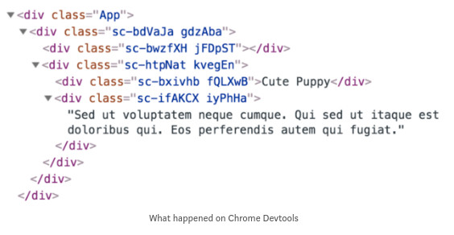

#### Without using styled-component

```js
import React from 'react'
import './content.css'

export default ({ skyblue }) => {

  /* add new css classes */
  let titleStyles = ['content__title']
  if (skyblue) {
    titleStyles.push('content--skyblue')
  }

  return (
    <div className="content">
      <div className="content__img" />
      <div className="content__info">
        <div className={titleStyles.join(' ')}>Cute Puppy</div>
        <div className="content__description">
          Sed ut voluptatem neque cumque. Qui sed ut itaque est doloribus qui.
          Eos perferendis autem qui fugiat.
        </div>
      </div>
    </div>
  )
}

```

Now using styled-component.
At first, we need to import styled-components to our component. We import it as a name called styled. Then we can define what HTML element should be used for each styled-component. For example,

``const Button = styled.button`` /* CSS Properties */ `

means this Button component stands for the styled-component render a <button />. Then we can simply move the CSS properties to each styled-component. That’s it!


```js
import React from 'react'
import styled from 'styled-components'

const ContentWrapper = styled.div`
  width: 80%;
  height: 300px;
  box-shadow: 0 0 5px 2px #ccc;
`

const Img = styled.div`
  display: inline-block;
  width: 300px;
  height: 100%;
  background-image: url('https://picsum.photos/300/300?image=1062');
`

const InfoWrapper = styled.div`
  display: inline-block;
  vertical-align: top;
  width: calc(100% - 300px);
  height: 100%;
  text-align: left;
`

const Title = styled.div`
  padding: 20px 0 0 20px;
  font-size: 48px;
  color: ${props => (props.skyblue ? 'skyblue' : 'black')};
`

const Description = styled.div`
  padding: 20px;
  font-size: 30px;
  font-style: italic;
  color: #888888;
`

export default ({ skyblue }) => {
  return (
    <ContentWrapper>
      
      <InfoWrapper>
        <Title skyblue>Cute Puppy</Title>
        <Description>
          Sed ut voluptatem neque cumque. Qui sed ut itaque est doloribus qui.
          Eos perferendis autem qui fugiat.
        </Description>
      </InfoWrapper>
    </ContentWrapper>
  )
}

```
We pass the prop skyblue to the Title component which was built with styled-components. Then we can simply pass a function to the CSS properties we want to modify via template literals. As you can see, we pass an arrow function props => (props.skyblue ? 'skyblue' : 'black')to determine under what condition should Title’s color be sky blue, and we just finish changing Title’s color!

### How About Debugging

Let’s open Chrome Devtools to see what happens when we build a component with styled-components.



Styled-components have a built-in CSS module system. This is great for solving the problem of classnames conflict. However, we definitely don’t know what classes are we using when we try to debug on Chrome Devtools. Do you know what HTML element we are using? absolutely not, right? You have to look back at each styled-component to check what HTML element is it using.