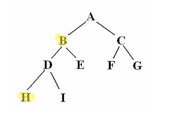

### Simple ans to why React app load faster is - its Because of virtual DOM.

The virtual DOM is a tree based on JavaScript objects created with React that resembles a DOM tree. Each time you need to change something in the DOM, React employs a different algorithm that exclusively re-renders the DOM nodes that have changed. Meaning, React allows developers to write code as if the entire page is rendered on each change while in the underhood React ONLY renders sub-components that have actually changed.

### What is DOM rendering

The basic task we're talking about is taking the internal state of the program and mapping it to something visible on the screen. You take an assortment of objects, arrays, strings, and numbers and end up with a tree of text paragraphs, forms, links, buttons, and images. On the web, the former is usually represented as JavaScript data structures, and the latter as the Document Object Model

We often call this process rendering, and you can think of it as a projection of your data model to a visible user interface. When you render a template with your data, you get a DOM (or HTML) representation of that data.

[http://teropa.info/blog/2015/03/02/change-and-its-detection-in-javascript-frameworks.html](http://teropa.info/blog/2015/03/02/change-and-its-detection-in-javascript-frameworks.html)

## How normal DOM (without React) works

##### 1> [https://medium.com/@gethylgeorge/how-virtual-dom-and-diffing-works-in-react-6fc805f9f84e](https://medium.com/@gethylgeorge/how-virtual-dom-and-diffing-works-in-react-6fc805f9f84e)

[https://developer.mozilla.org/en-US/docs/Mozilla/Introduction_to_Layout_in_Mozilla](https://developer.mozilla.org/en-US/docs/Mozilla/Introduction_to_Layout_in_Mozilla)

Since DOM is represented as a tree structure, and changes to the DOM is pretty quick but the changed element, and it’s children’s has to go through Reflow/Layout stage and then the changes has to be Re-painted which are slow. Therefore more the items to reflow/repaint, more slow your app becomes.

### 2> What Virtual-DOM does is, it tries to minimize these two stages, and thereby getting a better performance for a big complex app.

[https://hackernoon.com/virtual-dom-in-reactjs-43a3fdb1d130](https://hackernoon.com/virtual-dom-in-reactjs-43a3fdb1d130)

Rendering engines which is responsible for displaying or rendering the webpage on the browser screen parses the HTML page to create DOM. It also parses the CSS and applies the CSS to the HTML creating a render tree, this process is called as attachment.

Layout process give exact co-ordinates to each node of the render tree, where the node gets painted and displayed.

So when we do,

`document.getElementById('elementId').innerHTML = "New Value"`

Following thing happens:

Browser have to parses the HTML

It removes the child element of elementId

Updates the DOM with the “New Value”

Re-calculate the CSS for the parent and child

Update the layout i.e. each elements exact co-ordinates on the screen

Traverse the render tree and paint it on the browser display

Recalculating the CSS and changed layouts uses complex algorithm and they effect the performance.

Thus updating a Real DOM does not involves just updating the DOM but, it involves a lot of other process.

Also, each of the above steps runs for each update of the real DOM i.e. if we update the Real DOM 10 times each of the above step will repeat 10 times. This is why updating Real DOM is slow.

### Server-Side Rendering: The way it was before React and other libraries

Before the era of Big JavaScript, every interaction you had with a web application used to trigger a server roundtrip. Each click and each form submission meant that the webpage unloaded, a request was sent to the server, the server responded with a new page that the browser then rendered.

With this approach, there wasn't really any state to manage in the front-end. Each time something happened, that was the end of the universe, as far as the browser was concerned. Whatever state there was, it was a backend concern. The frontend was just some generated HTML and CSS, with perhaps a bit of JavaScript sprinkled on top.

While this was a very simple approach from a front-end perspective, it was also very slow. Not only did each interaction mean a full re-rendering of the UI, it was also a remote re-rendering, with a full roundtrip to a faraway data center.

[http://teropa.info/blog/2015/03/02/change-and-its-detection-in-javascript-frameworks.html](http://teropa.info/blog/2015/03/02/change-and-its-detection-in-javascript-frameworks.html)

## [What is virtual DOM?](https://hackernoon.com/virtual-dom-in-reactjs-43a3fdb1d130)

### Virtual DOM is in-memory representation of Real DOM. It is lightweight JavaScript object which is copy of Real DOM.

Updating virtual DOM in ReactJS is faster because ReactJS uses

- Efficient diff algorithm
- Batched update operations
- Efficient update of sub tree only
- Uses observable instead of dirty checking to detect change

## ReactJS uses observable’s to find the modified components. Whenever setState() method is called on any component, ReactJS makes that component dirty and re-renders it.

### Whenever setState() method is called, ReactJS creates the whole Virtual DOM from scratch. Creating a whole tree is very fast so it does not affect the performance.

### Once you render a JSX element, every single Virtual DOM object gets updated.Compared to updating real DOM objects, the Virtual DOM updates faster. Before updating, a copy of the virtual DOM is made and later compared with the updated Virtual DOM.

### So at any given time, ReactJS maintains two virtual DOM, one with the updated state Virtual DOM and other with the previous state Virtual DOM. Then React can figure out which objects have been changed, and this process is called Diffing. Once React knows which objects to update, it updates only those objects in the Real DOM.

ReactJS using diff algorithm compares both the Virtual DOM to find the minimum number of steps to update the Real DOM.

ReactJS uses following steps to find the difference in both the Virtual DOM’s

**1. Re-render all the children if parent state has changed.** If the state of a component has changed, then ReactJS re-renders all the child components even if child components are not modified. To prevent the unwanted re-render of the child components we can use shouldComponentUpdate() component life cycle method. This will further help in boosting the performance.

**2. Breadth First Search.** ReactJS traverse the tree using BST. Consider the below tree. States of element B and H have changed. So when using BST ReactJS reached element B it will by default re-render the element H. This is the reason to use BST for tree traversal

**3. Reconciliation.** It is the process to determine which parts of the Real DOM need to be updated. It follow below steps:

Two elements of different types will produce different trees.

## The developer can hint at which child elements may be stable across different renders with a key prop.

**Virtual DOM is the name React developers gave to their DOM manipulation engine.** Virtual DOM provides a series of Javascript calls that tell the library how to build an in-memory DOM tree and how to update it when data bound to it changes. The central piece of Virtual DOM is its smart diffing algorithm: once the differences in the model have been mapped to the in-memory copy of the DOM, the algorithm finds the minimum number of operations required to update the real DOM. This results in two copies of the in-memory DOM being present during the diffing process.

## Summing up, updating the browser’s DOM is a three-step process in React.

- Whenever anything may have changed, the entire UI will be re-rendered in a Virtual DOM representation.

- The difference between the previous Virtual DOM representation and the new one will be calculated.

- The real DOM will be updated with what has actually changed. This is very much like applying a patch.

- Also it uses things like keys in Arrays. Which allow it to have fast array changes in elements.

## Here are a few reasons why React has become so popular so quickly:

Working with the DOM API is hard. React basically gives developers the ability to work with a virtual browser that is more friendly than the real browser. React’s virtual browser acts like an agent between the developer and the real browser.

React enables developers to declaratively describe their User Interfaces and model the state of those interfaces. This means instead of coming up with steps to describe transactions on interfaces, developers just describe the interfaces in terms of a final state (like a function). When transactions happen to that state, React takes care of updating the User Interfaces based on that.

# What is reconciliation

React is magical, but it still can’t get around the fact that we must build a DOM for the user to see anything. Building a DOM on every page load is not really faster than old-fashioned HTTP calls right? So how does React avoid replacing the DOM every time a change is made?

### Before React ever completes the expensive operation of touching the client’s DOM, it does a bit of craft with the “virtual DOM”. Essentially, React holds a version of the DOM in memory, a node-tree with all the elements and their attributes.

### Whenever a change is made in your application, React takes each element and completes the process of “reconciliation”. At its core, this is just a side-by-side comparison of each component against the version in the virtual DOM. If they are the same, they are left alone. If the component has changed, then it is replaced in the virtual DOM and prepared for insertion into the real DOM. All of this happens incredibly fast.

And once your application begins to change many things at once or deal with large/complex components, you will see that React is a heaven-sent abstraction.

## When a React UI is rendered for the first time after launching the app, it is first rendered into a virtual DOM, which is not an actual DOM object graph, but a light-weight, pure JavaScript data structure of plain objects and arrays that represents a real DOM object graph. A separate process then takes that virtual DOM structure and creates the corresponding real DOM elements

## Then, when a change occurs, a new virtual DOM is created from scratch. That new virtual DOM will reflect the new state of the data model. React now has two virtual DOM data structures at hand: The new one and the old one. It then runs a diffing algorithm on the two virtual DOMs, to get the set of changes between them. Those changes, and only those changes, are applied to the real DOM: This element was added, this attribute's value changed, etc.

[http://teropa.info/blog/2015/03/02/change-and-its-detection-in-javascript-frameworks.html](http://teropa.info/blog/2015/03/02/change-and-its-detection-in-javascript-frameworks.html)

### Why Immutable function and Immutable, persistent data-structure is so important in React

One approach to controlling changes is to favor immutable, persistent data structures. They seem to be a particularly good fit with React's virtual DOM approach.

The thing about immutable data structures is that, as the name implies, you can never mutate one, but only produce new versions of it. If you want to change an object's attribute, you'll need to make a new object with the new attribute, since you can't change the existing one. Because of the way persistent data structures work, this is actually much more efficient than it sounds.

What this means in terms of change detection is that when a React component's state consists of immutable data only, there's an escape hatch: When you're re-rendering a component, and the component's state still points to the same data structure as the last time you rendered it, you can skip re-rendering. You can just use the previous virtual DOM for that component and the whole component tree stemming from it. There's no need to dig in further, since nothing could possibly have changed in the state.

## Some more Theory on Virtual DOM

Virtual Dom is javascript object as similar to real DOM. On every mutation triggered either through “setState, dispatcher ” react creates a new virtual tree from scratch by adjusting those changes. React can produce upto 200000 trees in 1 second. In fact, it can produce tree much faster and more efficiently. Creation of new virtual tree follows [Breadth-first search](https://en.wikipedia.org/wiki/Breadth-first_search) strategy so that changes of any node could be adjusted through parent node if the change has happened on parent node too. If the changes have been done at the root node itself (first root of tree), then react will scrap down the complete tree and create new tree from scratch and also trigger re-rendered for the child components again.

You might be wondering that why are we not hitting down the rendering performance, even though it creates virtual tree every time from scratch (in case of only change in parent node) and also trigger the render method of the child components again. Because all these happens without touching the real dom. Real Dom is still far away from the picture.

[Breadth-first search from Wikipedia](https://en.wikipedia.org/wiki/Breadth-first_search)
Breadth-first search (BFS) is an algorithm for traversing or searching tree or graph data structures. It starts at the tree root (or some arbitrary node of a graph, sometimes referred to as a 'search key'[1]), and explores all of the neighbor nodes at the present depth prior to moving on to the nodes at the next depth level.

It uses the opposite strategy as depth-first search, which instead explores the highest-depth nodes first before being forced to backtrack and expand shallower nodes.

### Batch Update

ReactJS using the diff algorithm to find the minimum number of steps to update the Real DOM. Once it has these steps, it executes all the steps in one event loop without involving the steps to repaint the Real DOM. Thus, if there are more elements which get updated ReactJS will wait for the event loop to finish then, in bulk will updated the real DOM with all the updated elements.

Once all the steps are executed, React will repaint the Real DOM. This means during the event loop, there is exactly one time when the Real DOM is being painted. Thus all the layout process will run only one time for updating the real DOM.

## Good Sources

- [https://hackernoon.com/virtual-dom-in-reactjs-43a3fdb1d130](https://hackernoon.com/virtual-dom-in-reactjs-43a3fdb1d130)

My collection of common JS / React / Node Interview questions, along with answers that I was putting together for myself while preparing for Interviews. Most of them, I was actually asked in real Interviews over the past few months. And very recentely I got my first job as full-stack Developer coming from a completely different educational and career background (Banking) and after completing my Programming Bootcamp from The Hacking School

This github repo, is by no means comprehensive, and for each of the concepts, there are better and more in depth coverage in the web (I have tried to include the sources as much as possible) - But my only aim with this repo is to have a reference tool so that I could continue a technical discussion with the interviewer for two, three or four hours.

https://github.com/rohan-paul/Awesome-JavaScript-Interviews

(https://www.thehackingschool.com/)
