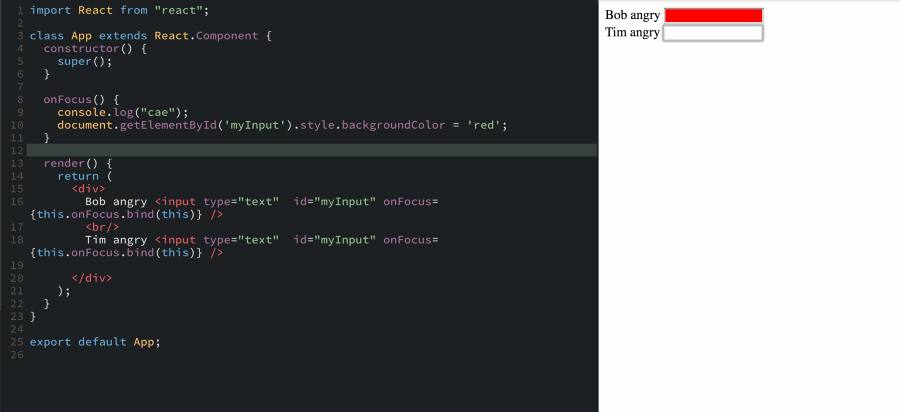

## When you need refs instead of ID’s ?

As we all know , ID’s works on a single element in whole DOM tree thus lets say we want to change the background-color on focus . With ID’s this will happen but only the first input box will get the red color

