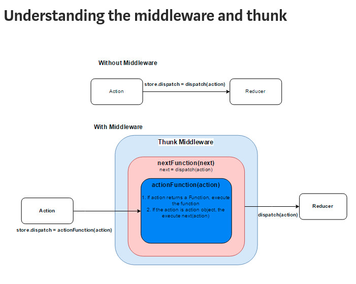

#### Thus, in summary there are two parts to Redux-Thunk:

- 1. A thunk creator, which is an action creator that returns a thunk (a.k.a. asynchronous action creators)
- 2. The thunk itself, which is the function that is returned from the thunk creator and accepts dispatch and setState as arguments

The reason that we need to use a middleware such as Redux-Thunk is because the Redux store only supports synchronous data flow. Thus, middleware to the rescue! Middleware allows for asynchronous data flow, interprets anything that you dispatch and finally returns a plain object allowing the synchronous Redux data flow to resume. Redux middleware can thus solve for many critical asynchronous needs (e.g., axios requests).

### First note that, the synchronous and pure flow of data through Redux’s components is well-defined with distinct, simple roles. Which is as below ->

### Action creators create objects → objects are dispatched to the store → the store invokes reducers → reducers generate new state → listeners are notified of state updates.

A thunk is another word for a function. It’s a special (and uncommon) name for a function that’s returned by another. Like this:

```js
function not_a_thunk() {
  // this one is a "thunk" because it defers work for later:
  return function() {
    console.log("do stuff now");
  };
}
```

If I want to execute the “do stuff now” part, you have to call it like `not_a_thunk()()` – calling it twice, basically.

At its heart, though, Redux is really simple. Actions are just objects – and they are expected to only be objects. They look like this:

```js
{
  type: "USER_LOGGED_IN",
  username: "dave"
}
```

And, since it’s kind of annoying to build objects by hand all the time, Redux has “action creators” that build these things:

```js
function userLoggedIn() {
  return {
    type: "USER_LOGGED_IN",
    username: "dave"
  };
}
```

Same action, but now you can “create” it by calling the userLoggedIn function.

Isn’t it kind of funny that Redux’s so-called “actions” don’t actually do anything? They’re just objects. Boring and simple and inert.

### **\*\***\*\***\*\***\***\*\***\*\***\*\***

Redux Thunk teaches Redux to recognize special kinds of actions that are in fact functions.

When an action creator returns a function, that function will get executed by the Redux Thunk middleware. This function doesn't need to be pure; it is thus allowed to have side effects, including executing asynchronous API calls. The function can also dispatch actions.

The thunk can be used to delay the dispatch of an action, or to dispatch only if a certain condition is met.

If Redux Thunk middleware is enabled, any time you attempt to dispatch a function instead of an action object, the middleware will call that function with dispatch method itself as the first argument.

And then since we “taught” Redux to recognize such “special” action creators (we call them thunk action creators), we can now use them in any place where we would use regular action creators.

### **\*\***\*\*\*\***\*\***\*\*\*\***\*\***\*\*\*\***\*\***

[https://medium.com/fullstack-academy/thunks-in-redux-the-basics-85e538a3fe60](https://medium.com/fullstack-academy/thunks-in-redux-the-basics-85e538a3fe60)

## Redux-Thunk source code has only expanded to fourteen lines total from its birth in 2016

https://github.com/reduxjs/redux-thunk/blob/master/src/index.js

```js
function createThunkMiddleware(extraArgument) {
  return ({ dispatch, getState }) => next => action => {
    if (typeof action === "function") {
      return action(dispatch, getState, extraArgument);
    }

    return next(action);
  };
}

const thunk = createThunkMiddleware();
thunk.withExtraArgument = createThunkMiddleware;

export default thunk;
```

#### What is a side-effect?

"Side Effect" is not a react-specific term. It is a general concept about behaviours of functions. A function is said to have side effect if it trys to modify anything outside its body. For example, if it modifies a global variable, then it is a side effect. If it makes a network call, it is a side effect as well.

A "side effect" is anything that affects something outside the scope of the function being executed. These can be, say, a network request, which has your code communicating with a third party (and thus making the request, causing logs to be recorded, caches to be saved or updated, all sorts of effects that are outside the function.

There are more subtle side effects, too. Changing the value of a closure-scoped variable is a side effect. Pushing a new item onto an array that was passed in as an argument is a side effect. Functions that execute without side effects are called "pure" functions: they take in arguments, and they return values. Nothing else happens upon executing the function. This makes the easy to test, simple to reason about, and functions that meet this description have all sorts of useful properties when it comes to optimization or refactoring.

Pure functions are deterministic (meaning that, given an input, they always return the same output), but that doesn't mean that all impure functions have side effects. Generating a random value within a function makes it impure, but isn't a side effect, for example.

#### What is side-effects in Redux or React

The natural Redux flow is this: some action is dispatched, and as a consequence, some state is changed.

But, most apps need to reach out to the outside world to be useful — whether by talking to the server, accessing local storage, recording analytics events, or something else entirely.

That process of calling into the real world is what side-effects are. They are a way of bridging the pure Redux world with the outside world.

But, we can’t handle side effects in reducers (they’re pure functions, they aren’t meant for making API calls).

Thunks transform action creators so that they can return functions (rather than JSON objects representing actions). We can then use these functions to make API requests and trigger dispatch calls to our redux store.

### Other sources to Read

1> This is the recommended one by thunk's own github page
[https://stackoverflow.com/questions/35411423/how-to-dispatch-a-redux-action-with-a-timeout/35415559#35415559](https://stackoverflow.com/questions/35411423/how-to-dispatch-a-redux-action-with-a-timeout/35415559#35415559)

2> [https://medium.com/@gethylgeorge/understanding-how-redux-thunk-works-72de3bdebc50](https://medium.com/@gethylgeorge/understanding-how-redux-thunk-works-72de3bdebc50)

3> [https://medium.com/@shoshanarosenfield/redux-thunk-vs-redux-saga-93fe82878b2d](https://medium.com/@shoshanarosenfield/redux-thunk-vs-redux-saga-93fe82878b2d)
